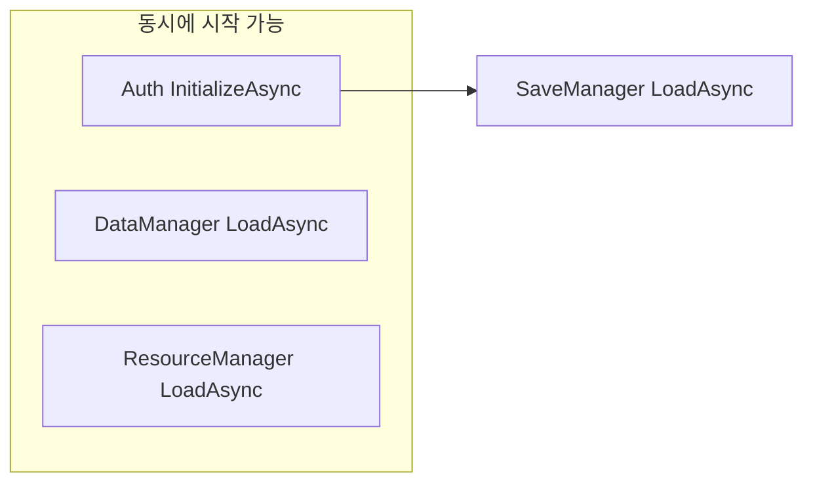
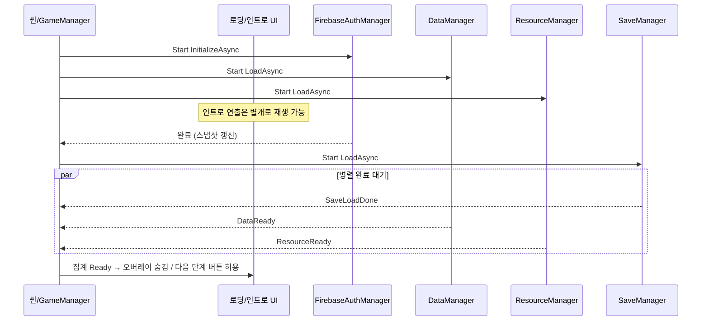
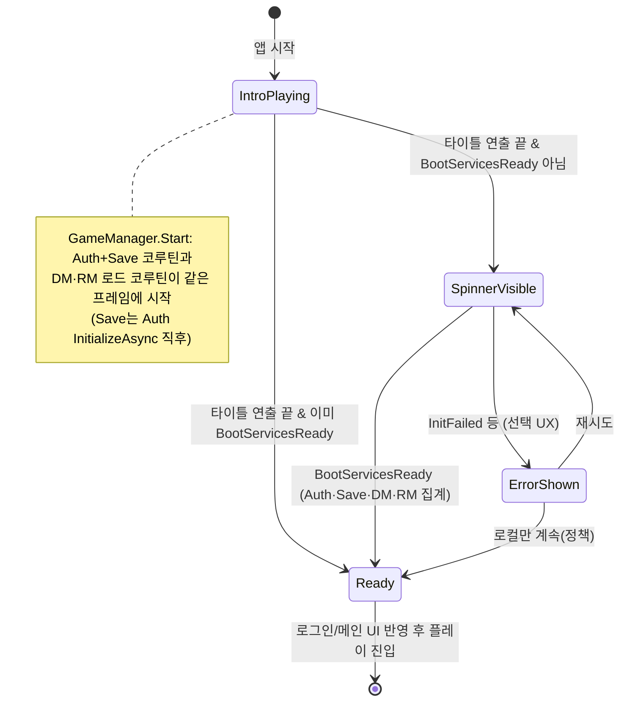
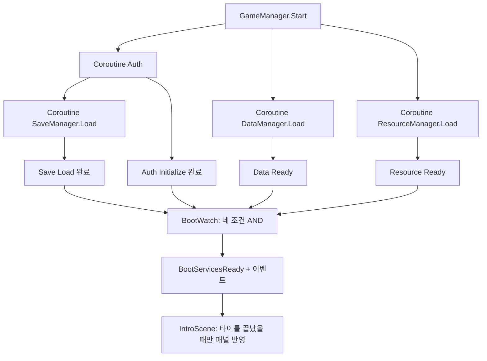

# 부트 설계안: 비동기 조기 시작 + 로딩 UI 집계

인트로 **연출 타임라인**과 **Auth·세이브·데이터·리소스 준비**를 분리한다. 작업은 시작 시점에 최대한 일찍 돌리고, 로딩 패널은 **“아직 끝나지 않은 필수 작업이 있는가?”**만 반영한다.

---

## 1. 원칙

| 원칙 | 설명 |
|------|------|
| 조기 시작 | 씬/오브젝트가 살아나면 곧바로(또는 1프레임 내) 각 서비스의 비동기 초기화·로드를 **시작**한다. 연출이 끝날 때까지 기다리지 않는다. |
| UI는 구독자 | 로딩창/스피너는 **집계 상태**만 본다. 연출 클립 끝 이벤트와 직접 묶지 않는다. |
| 의존성만 순서 | Save 백엔드(Firestore)는 Auth Phase가 `Initializing`이 아닐 때까지 확정이 안 될 수 있으므로, **세이브 로드는 Auth 1차 완료 이후**(또는 내부 대기)로 둔다. DM·RM은 현재 코드 기준 **세이브와 무관** → Auth와 **병렬** 가능. |
| 실패는 명시 | `InitFailed`·타임아웃·네트워크는 **문구 + 재시도** 또는 **로컬/게스트 폴백**으로 사용자에게 드러낸다. |

---

## 2. 현재(참고) vs 목표

**현재 (`GameManager.InitializeBootServicesRoutine`)**  
순차: `Auth` → `Save` → `DataManager` → `ResourceManager`.  
한 줄로 읽기 쉽지만, 늦게 시작하는 작업이 앞줄을 막고, **연출과 I/O 타임라인이 섞이기 쉽다.**

**목표**  
- **1차**: Auth / DM / RM을 **동시에 시작**(각자 코루틴 또는 병렬 대기).  
- **2차**: Auth가 `Initializing`을 벗어난 뒤(또는 그와 동시에 세이브 쪽이 대기하며) **Save Load** 실행.  
- **게이트**: “로비/플레이 진입 허용”은 `필수 작업 집합`이 모두 `Ready`일 때만 통과.  
- **로딩 UI**: 위 집계가 `false`이면 표시(연출 종료 직후에도 Auth 미완료면 **그때부터** 스피너가 보이는 패턴이 자연스럽다).

---

## 3. 의존 그래프 (작업 단위)



- **A**: Firebase 의존성 + Auth 인스턴스 + 첫 스냅샷.  
- **D, R**: Addressables만 사용 → **A와 병렬**해도 됨(현재 구현 기준).  
- **S**: 백엔드가 Auth Phase에 묶임 → **A 완료 후** 호출하거나, 호출은 일찍 하되 내부에서 Pending 대기(현재 `SaveManager` 방식과 호환).

---

## 4. 집계 상태 (로딩 UI가 볼 것)

예시 플래그(또는 작은 struct):

- `AuthBootDone` — `InitializeAsync` 코루틴이 끝남(성공/실패 무관, 스냅샷은 있음).  
- `SaveLoadDone` — `LoadAsync` 완료, `LoadedSaveData` 유효.  
- `DataReady` — `DataManager.IsLoaded`.  
- `ResourceReady` — `ResourceManager.IsLoaded()`.

**진입 허용(예시)**  
`AuthBootDone && SaveLoadDone && DataReady && ResourceReady`

**로딩 오버레이 표시**  
`!진입허용` 이거나, 정책상 “연결 중”만 강조할 때는 `Auth Phase == Initializing` 등 세분화 가능.

**에러 UI**  
`Phase == InitFailed` 또는 Save 타임아웃 등 → 메시지 + 재시도 / 로컬 계속.

(실제 프로젝트에 맞게 “플레이 최소 집합”을 줄여도 됨. 예: 인트로에서는 DM+RM만 필수 등.)

---

## 5. 플로우: 런타임 순서



---

## 6. 플로우: 사용자 관점(연출 vs 대기)



- **IntroPlaying** 동안 로딩·로그인 패널은 띄우지 않음(`IntroScene._titleSequenceFinished` 전).  
- **SpinnerVisible**은 타이틀 이후 `IsInitializeComplete && BootServicesReady`를 기다릴 때(구현상 `ShowLoading`).

---

## 7. 구현 시 최소 단계 (마이그레이션)

1. **`GameManager`**: 순차 `yield return` 대신, `StartCoroutine`으로 Auth / DM / RM을 **같은 프레임에** 돌리고, **완료 플래그 + 카운트다운**(또는 `Coroutine` 핸들 저장)으로 집계.  
2. **Auth 완료 콜백/코루틴 끝**에서만 `SaveManager.LoadAsync` 시작(또는 기존 Save 내부 Pending 대기 유지).  
3. **`BootServicesReady`**: 위 네 조건을 만족할 때만 `true` + `OnBootServicesReady` 호출.  
4. **IntroScene / UIManager**: `SessionChanged`·`BootServicesReady`(또는 전용 `IBootState`)만 구독해 스피너/에러 패널 제어 — **연출 타임라인 이벤트와 분리**.

---

## 8. 한 줄 요약

**일찍 돌리고, 늦게 막는다.**  
비동기 작업은 시작을 앞당기고, 로딩 UI는 **준비가 안 됐을 때만** 뜨게 두면, 연출이 짧아도·길아도 UX가 안정적이다.

---

## 9. 구체 설계 (역할·API·UI·이행 순서)

아래는 **지금 코드베이스**(`GameManager`, `IntroScene`, `SaveManager` Pending 대기)를 전제로 한 실행 가능한 설계다.

### 9.1 레이어 두 덩어리

| 레이어 | 책임 | 시점 |
|--------|------|------|
| **서비스 부트** | Auth 초기화, DM/RM Addressables 로드, Save Load 시작·완료 | `GameManager`가 **가능한 한 이른 `Start`(또는 Awake 직후 1프레임)**에 코루틴들을 **동시에 시작** |
| **인트로 UI 게이트** | 로딩 패널·로그인 패널을 **화면에 올릴지** | `IntroScene`의 **타이틀 연출 완료 후**에만 허용(현재 `RunIntroSequence`의 `ShowTitle` 콜백 이후와 동일한 개념) |

내부 상태·이벤트는 연출과 무관하게 갱신되고, **표시**만 `타이틀 끝 && 조건`으로 묶는다.

### 9.2 매니저별 노출 API (권장 형태)

| 컴포넌트 | 노출 | 의미 |
|----------|------|------|
| `FirebaseAuthManager` | `bool IsInitializeComplete { get; }` *(추가 권장)* | `InitializeAsync` 코루틴이 **한 번 끝남**(성공/실패 무관). `LastSnapshot.Phase`가 `Initializing`이 아닌 상태와 동치로 맞추면 UI가 단순해짐. |
| `SaveManager` | `bool IsLoadComplete { get; private set; }` *(추가 권장)* | `LoadAsync`가 **한 번 이상** 정상 종료(기본 세이브로 끝나도 `true`). 재로드 정책이 생기면 `ResetForHotReload()` 등 별도. |
| `DataManager` | 기존 `IsLoaded` | 유지. |
| `ResourceManager` | `IsLoaded()` → 가능하면 **`bool IsLoaded { get; }`로 통일** *(선택)* | 유지. |
| `GameManager` | `bool BootServicesReady` + `OnBootServicesReady` | **집계 조건**을 만족할 때만 `true` / 이벤트 1회. |

집계 조건(기본안):

```text
BootServicesReady =
  FirebaseAuthManager.IsInitializeComplete
  && SaveManager.IsLoadComplete
  && DataManager.IsLoaded
  && ResourceManager.IsLoaded
```

`InitFailed`여도 Auth 코루틴은 끝났으므로 `IsInitializeComplete == true`로 두고, **에러 UI는 `LastSnapshot.Phase == InitFailed`**로 판별한다.

### 9.3 `GameManager.Start`에서 할 일 (한 프레임)

1. `StartCoroutine(AuthBootRoutine())` — 내부에서 `yield return _firebaseAuthManager.InitializeAsync();` 후 `IsInitializeComplete = true`(또는 `FirebaseAuthManager` 내부에서 설정).  
2. `StartCoroutine(_dataManager.LoadAsync(...))` — 기존과 동일.  
3. `StartCoroutine(_resourceManager.LoadAsync(...))` — 기존과 동일.  
4. **Save**: `AuthBootRoutine` **끝에서** `StartCoroutine(_saveManager.LoadAsync(...))`를 호출하거나, 별도 `SaveBootRoutine`을 Auth 완료 이벤트에 묶는다. (Save 내부 Pending 대기는 **안전망**으로 유지 가능.)  
5. `StartCoroutine(BootWatchRoutine())` — 매 프레임 또는 이벤트-driven으로 위 네 조건을 검사해, 참이 되는 순간 `BootServicesReady = true`, `OnBootServicesReady?.Invoke()` **한 번만**.

순차 `yield return` 체인은 제거하고, **여러 코루틴 + 집계**로 바꾼다.

### 9.4 인트로 UI 표시 규칙 (수식)

`IntroScene`에 **불리언** `TitleSequenceFinished`(현재 `titleDone`과 동일)를 UI 정책의 전제로 둔다.

- **로딩 패널을 켤 수 있는가**  
  `TitleSequenceFinished && (!BootServicesReady || !auth.LastSnapshot.IsInitFinished)`  
  *(정책에 따라 `IsInitFinished`만으로도 가능 — 팀에서 “부트 전체”를 막을지 “Auth만” 막을지 선택)*

- **로그인 패널을 켤 수 있는가**  
  `TitleSequenceFinished && (Phase == InitFailed || Phase == ReadyGuest || …)`  
  기존 `ApplyAuthUiFromSnapshot` 분기를 **그대로** 쓰되, 호출 시점을 “타이틀 끝 + 스냅샷 확정”으로 제한.

- **부트가 타이틀보다 먼저 끝난 경우**  
  연출 중에는 패널을 안 띄우다가, 타이틀 끝나자마자 `BootServicesReady`가 이미 true면 **스피너 없이** 바로 로그인/시작 UI로 갈 수 있음.

구현 패턴: `SessionChanged` / `OnBootServicesReady`에 구독해 두되, 핸들러 첫 줄에 `if (!TitleSequenceFinished) { _pendingUiRefresh = true; return; }`. 타이틀 콜백에서 `_pendingUiRefresh`이면 `RefreshIntroUi()` 한 번 호출.

### 9.5 이벤트 흐름 (요약)



### 9.6 이행 순서 (리스크 낮은 순)

1. **플래그 추가**: `FirebaseAuthManager.IsInitializeComplete`, `SaveManager.IsLoadComplete` (`LoadAsync` 입구/출구에서 설정).  
2. **`GameManager` 병렬화**: Auth / DM / RM 동시 시작 + `BootWatchRoutine`으로 기존 `BootServicesReady` 의미 맞추기. Save는 Auth 직후 시작.  
3. **`IntroScene`**: 타이틀 완료 전에는 `ShowLoading`/`ShowLoginPanel` 호출 금지 + deferred refresh.  
4. **(선택)** `ILoadableService` 같은 공통 인터페이스로 `IsLoaded` 이름 통일.  
5. **(선택)** 에러 전용 `BootPhase.Failed` / 재시도 버튼은 `InitFailed` + Save 타임아웃에 연결.

### 9.7 현재 코드와의 차이 한 줄

- **지금**: `IntroScene`이 타이틀 후 `auth.LastSnapshot.IsInitFinished`만 기다리고, DM/RM/세이브 완료는 **같은 시점의 UX에 직접 묶여 있지 않음**.  
- **목표**: DM/RM/Save까지 **같은 집계(`BootServicesReady`)**에 넣고, **표시 시점만** 타이틀 게이트로 제어한다.

### 9.8 구현 반영 (코드베이스)

- `FirebaseAuthManager.IsInitializeComplete` — `InitializeAsync` 모든 종료 경로에서 `true`.  
- `SaveManager.IsLoadComplete` — `LoadAsync` 모든 종료 경로에서 `true`.  
- `GameManager.Start` — `AuthThenSaveBootRoutine` / `DataBootRoutine` / `ResourceBootRoutine` / `BootWatchRoutine` 동시 시작.  
- `IntroScene` — 타이틀 후 `IsInitializeComplete && BootServicesReady`까지 로딩; 타이틀 전에는 `SessionChanged`로 UI 갱신 안 함, 이후에는 `SessionChanged`로 스냅샷 반영.
