# Project Starfall

> 객체지향 설계와 데이터 기반 아키텍처로 구축한 확장 가능한 Unity RPG 게임입니다.
> 

> 이 프로젝트는 코드 품질 향상과 문서화 작업을 위해 Cursor, Trae, WindSurf 등 AI 개발 도우미를 보조적으로 활용했습니다. 핵심 아키텍처 설계와 구현은 개발자의 주도하에 진행되었습니다.

[🎮 게임 플레이 영상](https://youtu.be/68GyOBLbEL0?si=jMJzJQlJAZw_iTM8) | [📦 빌드 다운로드](https://drive.google.com/file/d/1W-kQanPIanT2rcA6QPB2fi-XtjkgfTfw/view?usp=drive_link) | [🔗 GitHub Repository](https://github.com/ProgramingLanguageStudy/Project-Starfall)

> **Last Updated**: 2026.03.26 | **Unity**: 6000.3.10f1 | **Status**: Phase 2 (Content Loop)

---

## 🎮 인게임 이미지

### 🔐 인트로 & 클라우드 로그인 시스템
<table>
<tr>
<td><strong>🔑 Firebase 로그인 화면</strong><br>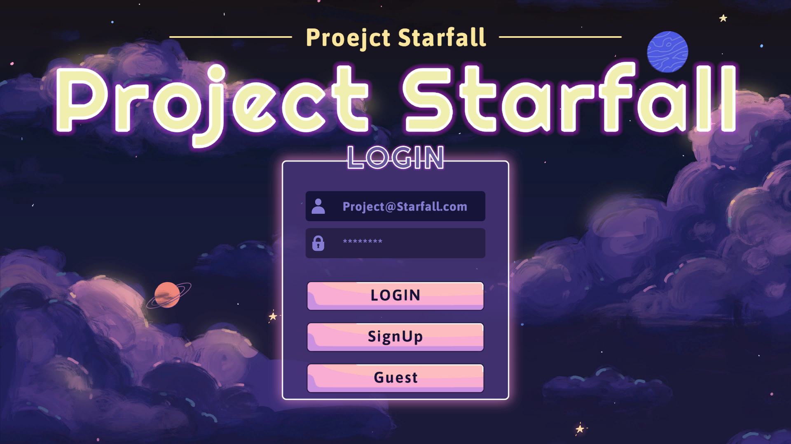</td>
<td><strong>⚠️ 로그인 에러 처리</strong><br>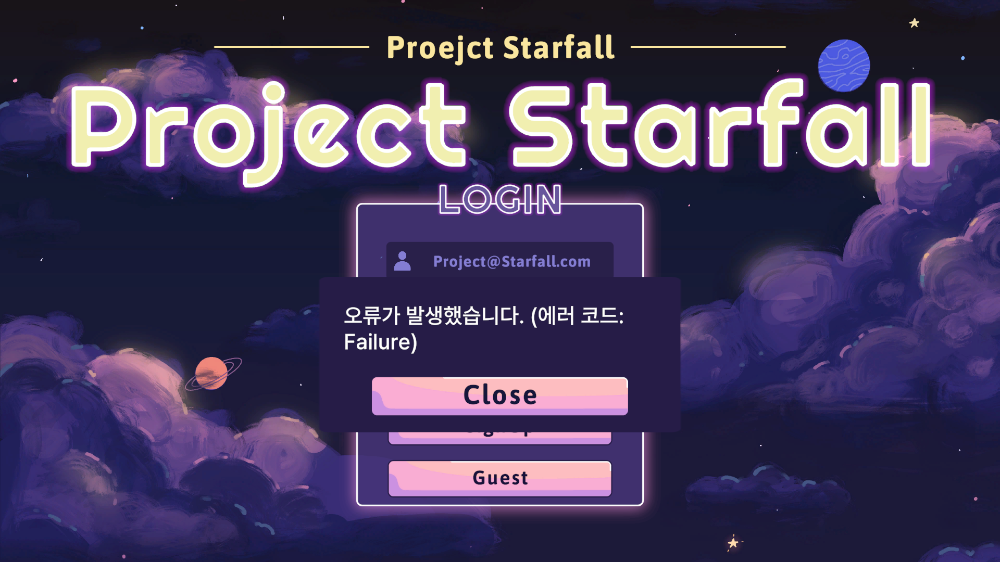</td>
</tr>
<tr>
<td><strong>🐛 디버그 로그 모드</strong><br>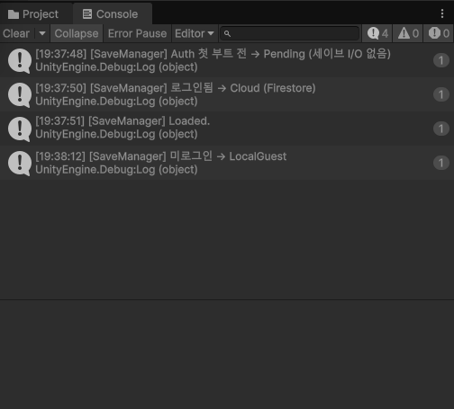</td>
<td><strong>✅ 로그인 성공 및 게임 시작</strong><br>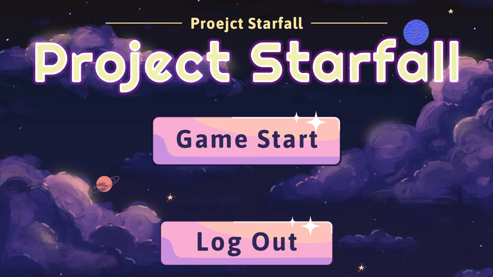</td>
</tr>
</table>

### ⚔️ 분대 시스템
<table>
<tr>
<td><strong>🤝 동료 영입 퀘스트</strong><br>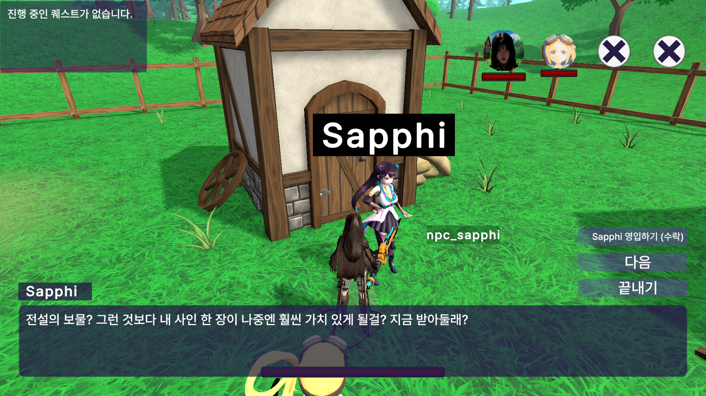</td>
<td><strong>✅ 영입 완료 시나리오</strong><br>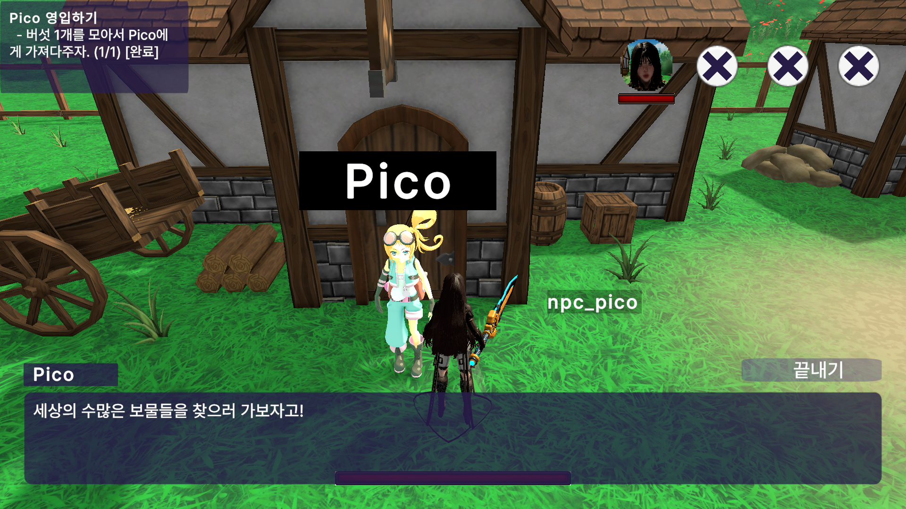</td>
</tr>
<tr>
<td><strong>� 리더 교체 시스템</strong><br>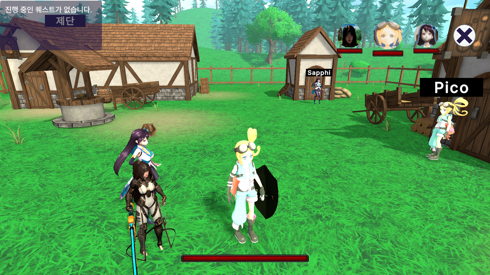</td>
<td><strong>⚔️ 분대 협공 전투</strong><br>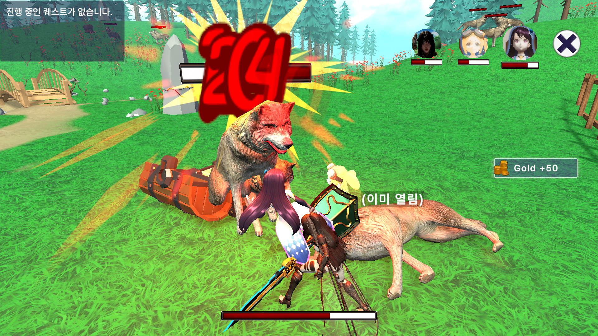</td>
</tr>
</table>

### 🎒 성장 및 탐험 시스템
<table>
<tr>
<td><strong>💬 퀘스트 수락</strong><br>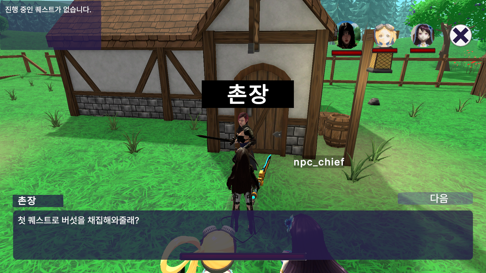</td>
<td><strong>🗺️ 지도 확인</strong><br>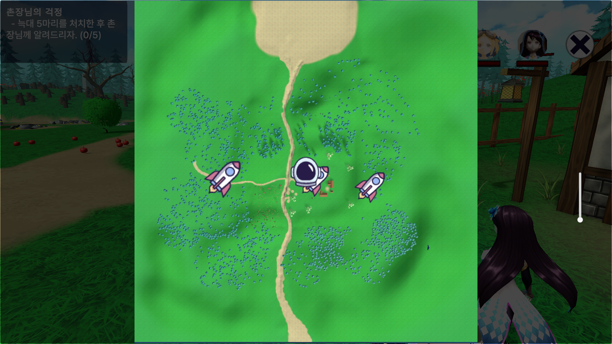</td>
</tr>
<tr>
<td><strong>🌀 포탈 이동</strong><br>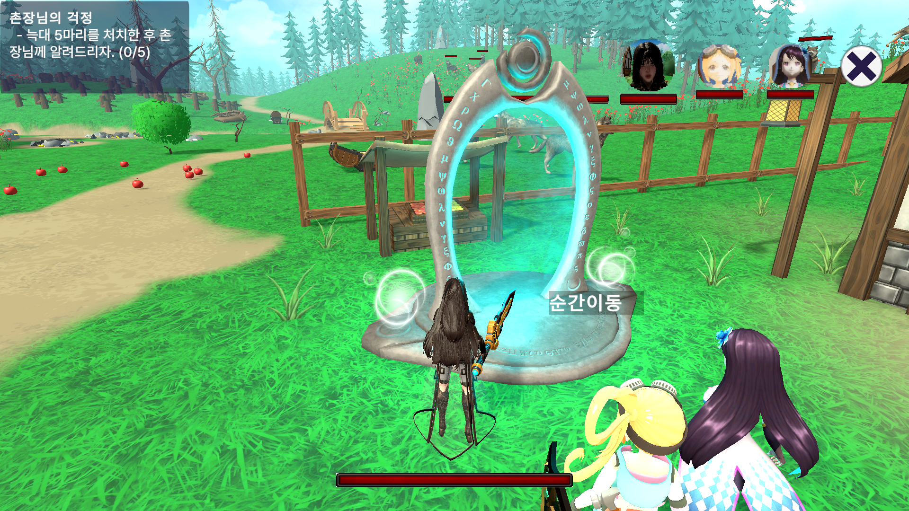</td>
<td><strong>💎 보물 획득</strong><br>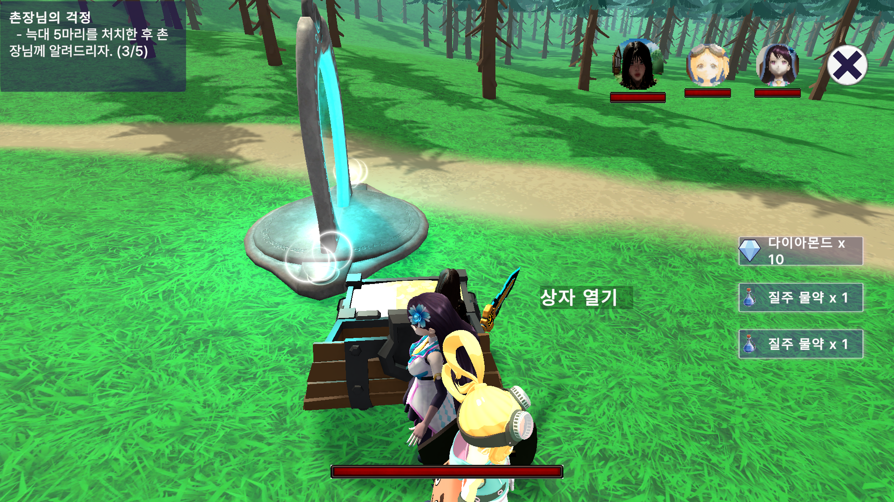</td>
</tr>
<tr>
<td><strong>✅ 퀘스트 완료</strong><br>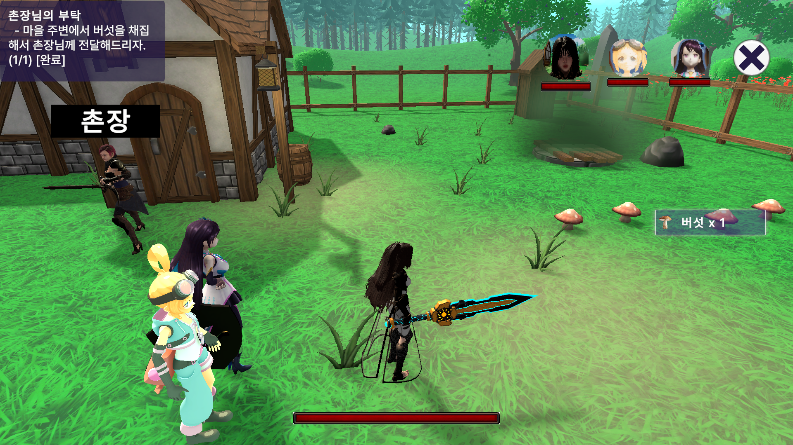</td>
<td><strong>📈 레벨업 성장</strong><br>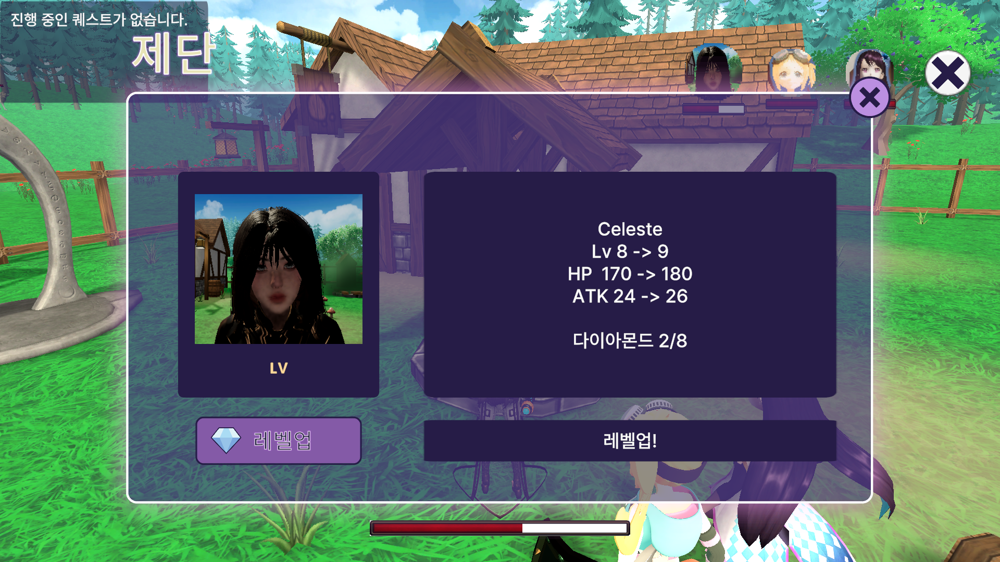</td>
</tr>
</table>

---

## 핵심 기술 요약

- **플레이어·동료 분대**: 한 명을 직접 조종하고, 나머지는 AI(AIBrain)가 상황에 맞춰 추적 및 전투를 수행하는 유기적인 분대 시스템
- **인증 및 클라우드 세이브**: **Firebase Auth**를 이용한 계정 관리와 **Firestore**를 통한 서버 기반 데이터 영속성 확보
- **비동기 에셋 관리**: **Addressables** 시스템을 도입하여 에셋을 그룹으로 관리, 추후 런타임 중 필요한 에셋만 동적 로드할 수 있도록 시스템 구축
- **고성능 오브젝트 풀링**: 적, 이펙트, 아이템 등 빈번한 생성/파괴가 일어나는 객체들을 **PoolManager**를 이용한 오브젝트 풀링으로 관리하여 성능 스파이크 방지
- **분대 교체(Swap)**: 실시간으로 조종 대상을 순환 전환하며 각기 다른 캐릭터로 탐험 및 전투 가능
- **동료 영입 및 시나리오**: 퀘스트 및 대화 시스템과 연동하여 특정 퀘스트 완료 시 NPC를 분대에 영입하는 확장형 구조
- **지능형 적 AI**: 어그로 시스템 기반의 타겟팅, 상태 머신을 활용한 패턴 전투 및 처치 퀘스트 자동 연동
- **유연한 상호작용**: 대화, 인벤토리 등 RPG의 핵심 요소들을 모듈화하여 독립적인 컴포넌트로 구성
- **스마트 지도 및 포탈 시스템**: `RenderTexture` 기반의 실시간 지도, 줌/스크롤 기능 및 해금된 포탈을 통한 전역 순간이동 시스템
- **사망 및 리스폰**: 부활 시스템 및 위치 보정 로직 포함
---

## 1. 프로젝트 소개

### 1.1 게임 개요

**Project Starfall**은 **분대 시스템 기반 3인칭 RPG**입니다. 
단순한 기능 구현을 넘어, **객체지향 설계(OOP)**와 **데이터 기반 디자인(Data-Driven Design)**을 통해 콘텐츠 확장성과 시스템 유지보수성을 극대화하는 것을 목표로 제작되었습니다.

### 1.2 프로젝트 진행 단계

| 단계 | 상태 | 주요 성과 |
|------|------|-----------|
| **Phase 1: Core Systems** | ✅ 완료 | 분대/전투/세이브/퀘스트/대화 핵심 시스템 구축 |
| **Phase 2: Content Loop** | 🚧 진행 중 | 성장-보상 루프, 골드/장비/레벨업 시스템 |
| **Phase 3: Polish** | 📋 예정 | UX 개선, 밸런싱, 추가 콘텐츠 |

---

## 2. 핵심 기술 및 아키텍처

### 2.0 전체 시스템 아키텍처

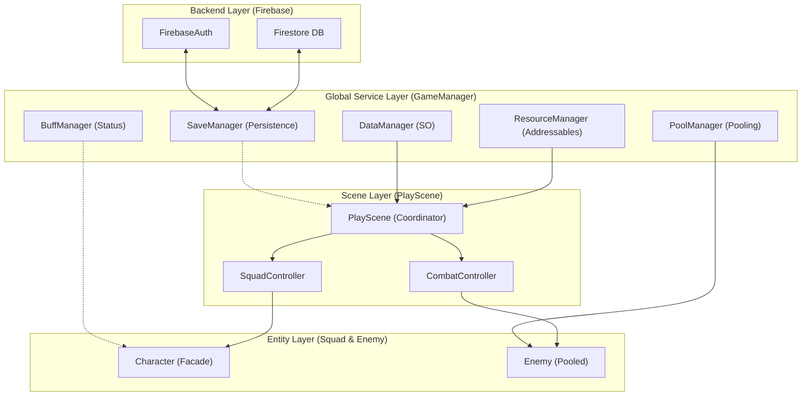
```mermaid
flowchart TB
    subgraph "Backend Layer (Firebase)"
        Auth["FirebaseAuth"]
        DB["Firestore DB"]
    end

    subgraph "Global Service Layer (GameManager)"
        DM["DataManager (SO)"]
        RM["ResourceManager (Addressables)"]
        PM["PoolManager (Pooling)"]
        SM["SaveManager (Persistence)"]
        BM["BuffManager (Status)"]
    end

    subgraph "Scene Layer (PlayScene)"
        PSC["PlayScene (Coordinator)"]
        SC["SquadController"]
        CC["CombatController"]
    end

    subgraph "Entity Layer (Squad & Enemy)"
        Char["Character (Facade)"]
        Enemy["Enemy (Pooled)"]
    end

    Auth <--> SM
    DB <--> SM
    SM -.-> PSC
    DM --> PSC
    RM --> PSC
    PM --> Enemy
    BM -.-> Char
    PSC --> SC
    PSC --> CC
    SC --> Char
    CC --> Enemy
```

**아키텍처 핵심 원칙**
- **Centralized Management**: `GameManager`가 전역 서비스 통합
- **Decoupled Entities**: 인터페이스 기반 통신으로 독립성 확보
- **Data-Driven Flow**: `DataManager`를 통한 콘텐츠 확장성

---

### 2.1 하이브리드 Addressables 콘텐츠 관리 (Preload & On-demand Ready)

| 구분 | 내용 |
|------|------|
| **문제** | 모든 에셋을 처음에 로드하면 메모리 낭비가 심하고, 반대로 매번 비동기 로드만 하면 런타임 성능 저하\(Stuttering\)가 발생할 수 있음. |
| **해결** | **하이브리드 아키텍처** 설계. 현재는 성능 안정성을 위해 핵심 프리팹을 라벨 기반으로 프리로드\(Preload\)하여 동기식\(`GetPrefab`\)으로 즉시 사용하며, 향후 대규모 에셋 확장을 대비해 비동기 로드\(`GetPrefabAsync`\) 인터페이스를 선제적으로 구축. |
| **결과** | 최적의 메모리 점유율 유지 및 런타임 성능 확보, 향후 에셋 규모 확장에 유연하게 대응 가능한 확장성 확보. |

#### 도식

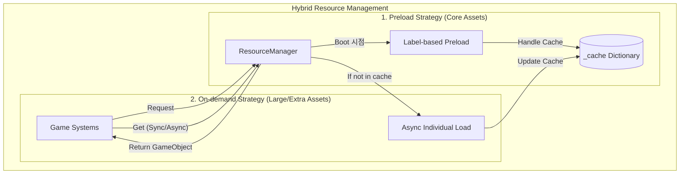
```mermaid
flowchart TD
    subgraph "Hybrid Resource Management"
        Loader["ResourceManager"]
        
        subgraph "1. Preload Strategy (Core Assets)"
            Loader -->|"Boot 시점"| PL["Label-based Preload"]
            PL -->|"Handle Cache"| Cache[("_cache Dictionary")]
        end
        
        subgraph "2. On-demand Strategy (Large/Extra Assets)"
            System["Game Systems"] -->|"Request"| Loader
            Loader -->|"If not in cache"| AL["Async Individual Load"]
            AL -->|"Update Cache"| Cache
        end
        
        System -->|"Get (Sync/Async)"| Loader
        Loader -->|"Return GameObject"| System
    end
```

**핵심 코드**

```csharp
// ResourceManager.cs - 하이브리드 접근 방식
// 1. 캐시된 에셋 즉시 반환 (프리로드 된 경우)
public GameObject GetPrefab(string category, string name) { ... }

// 2. 캐시에 없으면 비동기 로드 후 반환 (On-demand 확장)
public async Task<GameObject> GetPrefabAsync(string category, string name)
{
    var key = $"{category}/{name}";
    if (_cache.TryGetValue(key, out var handle)) return handle.Result;

    var loadHandle = Addressables.LoadAssetAsync<GameObject>(address);
    await loadHandle.Task;
    _cache[key] = loadHandle;
    return loadHandle.Result;
}
```

---

### 2.2 Firebase 백엔드 연동 (인증 & 클라우드 저장)

| 구분 | 내용 |
|------|------|
| **문제** | 로컬 세이브는 기기 분실 시 데이터가 유실되며, 여러 기기에서 동일한 계정으로 플레이할 수 없음. |
| **해결** | **인증**: `FirebaseAuthManager`를 구현하여 이메일/비밀번호 기반 로그인 시스템 구축.<br>**서버 저장**: `FirestoreSaveBackend`를 구현하여 유저 UID별로 세이브 데이터를 Firestore에 JSON 형태로 저장. |
| **결과** | 유저 데이터의 영속성 확보 및 서버 기반의 안정적인 데이터 관리 체계 구축. |

**핵심 코드**

```csharp
// FirebaseAuthManager.cs - 이메일 로그인
public void SignIn(string email, string password, Action onSuccess, Action<string> onError)
{
    _auth.SignInWithEmailAndPasswordAsync(email, password)
        .ContinueWithOnMainThread(task => {
            if (task.IsFaulted) onError?.Invoke("로그인 실패");
            else onSuccess?.Invoke();
        });
}

// FirestoreSaveBackend.cs - 클라우드 데이터 저장
public Task<bool> SaveInternalAsync(SaveData data)
{
    var json = JsonUtility.ToJson(data);
    var docRef = _db.Collection("users").Document(_userId)
        .Collection("save").Document("slot0");

    var dict = new Dictionary<string, object> { ["data"] = json };
    return docRef.SetAsync(dict, SetOptions.MergeAll).ContinueWith(t => t.IsCompleted);
}
```

#### 도식

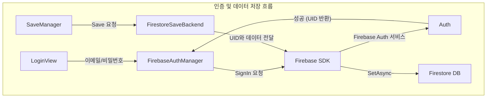
```mermaid
flowchart TB
    subgraph "인증 및 데이터 저장 흐름"
        UI["LoginView"] -->|"이메일/비밀번호"| AuthManager["FirebaseAuthManager"]
        AuthManager -->|"SignIn 요청"| FirebaseSDK["Firebase SDK"]
        FirebaseSDK -->|"Firebase Auth 서비스"| AuthSvc["Auth"]
        AuthSvc -->|"성공 (UID 반환)"| AuthManager

        SaveManager["SaveManager"] -->|"Save 요청"| FirestoreBackend["FirestoreSaveBackend"]
        FirestoreBackend -->|"UID와 데이터 전달"| FirebaseSDK
        FirebaseSDK -->|"SetAsync"| FirestoreDB["Firestore DB"]
    end
```

---

### 2.3 커스텀 오브젝트 풀링 시스템

| 구분 | 내용 |
|------|------|
| **문제** | 전투 중 대량의 적, 이펙트가 반복적으로 생성/파괴되면서 발생하는 CPU 부하 및 GC 스파이크로 인한 프레임 드랍. |
| **해결** | `PoolManager`를 통한 객체 재사용 로직 구현. `Poolable` 컴포넌트를 통해 객체 상태를 리셋하고, 런타임 중 `Instantiate` 호출을 최소화. |
| **결과** | 빈번한 전투 상황에서도 안정적인 프레임 유지 및 메모리 관리 효율 극대화. |

**핵심 코드**

```csharp
// PoolManager.cs - 객체 획득 및 반환 인터페이스
public GameObject Pop(GameObject prefab)
{
    Pool pool = GetPool(prefab);
    if (pool == null)
    {
        Debug.LogError($"[PoolManager] Pool not found for prefab: {prefab.name}");
        return null;
    }
    
    GameObject result = pool.Pop();
    if (result == null)
    {
        Debug.LogError($"[PoolManager] Failed to pop object from pool: {prefab.name}");
    }
    return result;
}

public void Push(GameObject prefab, GameObject instance)
{
    Pool pool = GetPool(prefab);
    if (pool == null)
    {
        Debug.LogError($"[PoolManager] Pool not found for prefab: {prefab.name}");
        Destroy(instance);
        return;
    }
    
    pool.Push(instance);
}

// Poolable.cs - 객체 스스로 풀에 반환되는 구조
public class Poolable : MonoBehaviour
{
    private Pool _pool;
    public void SetPool(Pool pool) => _pool = pool;

    public void ReturnToPool()
    {
        if (_pool != null)
        {
            _pool.Push(gameObject);
        }
        else
        {
            Debug.LogError($"[Poolable] Pool is null for object: {gameObject.name}");
            Destroy(gameObject);
        }
    }
}
```

#### 도식

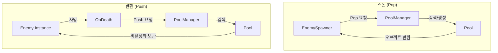
```mermaid
flowchart TB
    subgraph "스폰 (Pop)"
        Spawner["EnemySpawner"] -->|"Pop 요청"| PoolManager_Pop["PoolManager"]
        PoolManager_Pop -->|"검색/생성"| Pool_Pop["Pool"]
        Pool_Pop -->|"오브젝트 반환"| Spawner
    end
    subgraph "반환 (Push)"
        Enemy["Enemy Instance"] -->|"사망"| OnDeath["OnDeath"]
        OnDeath -->|"Push 요청"| PoolManager_Push["PoolManager"]
        PoolManager_Push -->|"검색"| Pool_Push["Pool"]
        Pool_Push -->|"비활성화 보관"| Enemy
    end
```

---

### 2.4 데이터 기반 시스템 확장 (Data-Driven Design)

| 구분 | 내용 |
|------|------|
| **문제** | 새로운 적이나 아이템을 추가할 때마다 코드를 수정하거나 씬의 스포너에 프리팹을 직접 할당해야 하는 번거로움과 오류 가능성. |
| **해결** | 모든 콘텐츠를 `BaseData(SO)`로 규격화하고 `DataManager`에서 통합 관리. 스포너는 문자열 ID만 알고 있으면 `ResourceManager`와 연동하여 데이터와 에셋을 동적으로 매칭. |
| **결과** | 기획자가 코드 수정 없이 데이터 시트\(SO\) 설정만으로 새로운 콘텐츠를 즉시 게임에 반영할 수 있는 확장성 확보. |

#### 도식

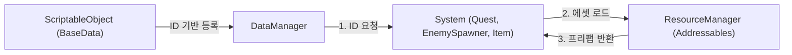
```mermaid
flowchart LR
    SO["ScriptableObject (BaseData)"] -->|"ID 기반 등록"| DM["DataManager"]
    DM -->|"1. ID 요청"| Requester["System (Quest, EnemySpawner, Item)"]
    Requester -->|"2. 에셋 로드"| RM["ResourceManager (Addressables)"]
    RM -->|"3. 프리팹 반환"| Requester
```

**핵심 코드**

```csharp
// DataManager.cs - 제네릭 데이터 조회
public T Get<T>(string id) where T : BaseData
{
    string category = typeof(T).Name;
    if (typeof(ItemData).IsAssignableFrom(typeof(T))) category = "ItemData";
    
    string key = $"{category}/{id}";
    return _cache.TryGetValue(key, out BaseData cached) ? cached as T : null;
}
```

---

### 2.5 모듈형 세이브 컨트리뷰터 (Contributor Pattern)

| 구분 | 내용 |
|------|------|
| **문제** | 세이브 항목(인벤토리, 퀘스트, 위치 등)이 늘어날수록 `SaveManager`의 코드가 비대해지고 시스템 간 결합도가 높아짐. |
| **해결** | `ISaveContributor` 인터페이스 도입. 각 시스템이 자신의 데이터만 관리하도록 분리하고, `SaveManager`는 이들을 순회하며 데이터를 수집/배포하는 역할만 수행. |
| **결과** | 새로운 저장 항목 추가 시 기존 코드를 건드리지 않고 새로운 Contributor만 추가하면 되는 개방-폐쇄 원칙\(OCP\) 준수. |

#### 도식

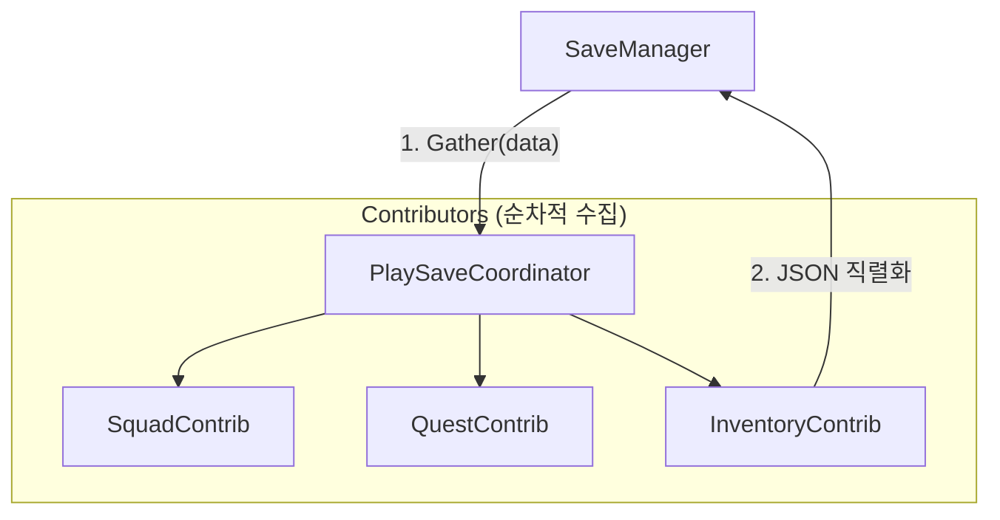
```mermaid
flowchart TB
    SaveManager["SaveManager"] -->|"1. Gather(data)"| PSC["PlaySaveCoordinator"]
    subgraph "Contributors (순차적 수집)"
        PSC --> C1["SquadContrib"]
        PSC --> C2["QuestContrib"]
        PSC --> C3["InventoryContrib"]
    end
    C3 -->|"2. JSON 직렬화"| SaveManager
```

**핵심 코드**

```csharp
// ISaveContributor.cs - 인터페이스 정의
public interface ISaveContributor
{
    string Key { get; }
    void Gather(SaveData data);
    void Spread(SaveData data);
}

// SquadSaveContributor.cs - 구체적 구현 예시
public class SquadSaveContributor : SaveContributorBehaviour, ISaveContributor
{
    public string Key => "Squad";
    public void Gather(SaveData data) => data.squad = _squad.GetSaveData();
    public void Spread(SaveData data) => _squad.LoadSaveData(data.squad);
}
```

---

### 2.6 안전한 씬 초기화 파이프라인 (Safe Boot Sequence)

| 구분 | 내용 |
|------|------|
| **문제** | 씬 로딩 시 시스템 초기화 순서가 꼬여 `NullReferenceException`이 발생하거나, 글로벌 매니저가 준비되기 전에 로직이 실행되는 문제. |
| **해결** | `PlayScene` 시작 시 `GameManager`의 모든 서비스(Data, Pool, Resource)가 로딩될 때까지 코루틴으로 안전하게 대기하는 부트 시퀀스 구축. |
| **결과** | 비동기 로딩 환경에서도 시스템 간 의존성 순서를 보장하여 런타임 안정성 획득. |

#### 도식

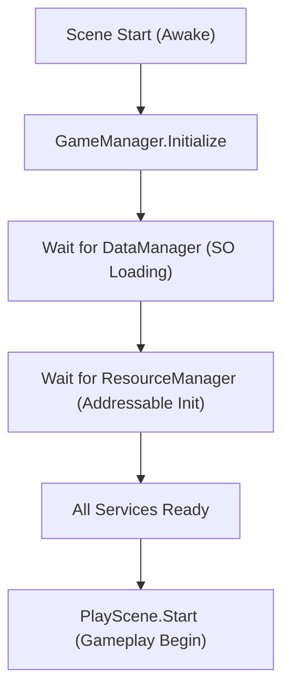
```mermaid
flowchart TD
    Start["Scene Start (Awake)"] --> InitGM["GameManager.Initialize"]
    InitGM --> WaitData["Wait for DataManager (SO Loading)"]
    WaitData --> WaitRes["Wait for ResourceManager (Addressable Init)"]
    WaitRes --> Ready["All Services Ready"]
    Ready --> PlayScene["PlayScene.Start (Gameplay Begin)"]
```

**핵심 코드**

```csharp
// PlayScene.cs - 부트 시퀀스 대기 로직
private IEnumerator WaitForBootThenInitializeRoutine()
{
    // GameManager 서비스가 모두 준비될 때까지 대기
    while (!GameManager.Instance.BootServicesReady)
    {
        yield return null;
    }

    // 준비 완료 후 씬 시스템 초기화
    Initialize();
}
```

---

## 3. 주요 시스템 구현 (Feature Implementation)

> 위에서 구축한 핵심 아키텍처를 바탕으로 구현된 구체적인 게임 기능들입니다.

### 3.A 핵심 게임플레이 루프 (Core Gameplay Loop)

#### 3.1 분대 및 캐릭터 시스템 (Facade & Event-driven)

<table>
<tr>
<td><strong>🏗️ 캐릭터 구조</strong><br>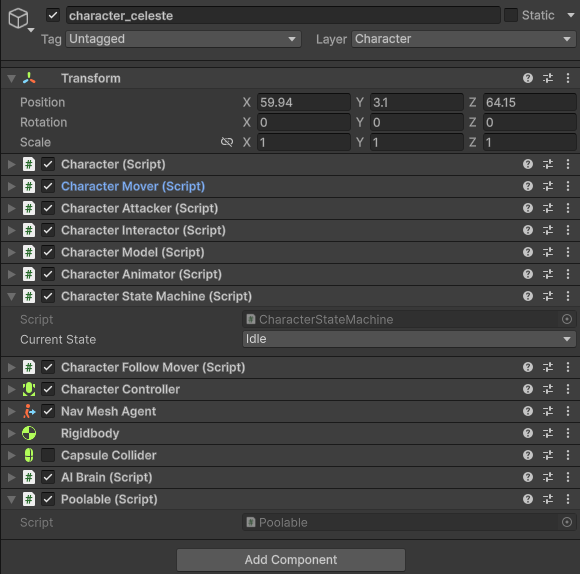</td>
<td><strong>👥 분대 시스템</strong><br></td>
</tr>
</table>

**시스템 특징**
- **Facade 패턴**: 캐릭터의 복잡한 하위 시스템을 중앙에서 통합 관리
- **이벤트 기반**: 상태 변경 시 필요한 컴포넌트만 이벤트로 통신하여 성능 최적화
- **인터페이스 주입**: 의존성 주입으로 컴포넌트 간 결합도 최소화
- **상태 관리**: StateMachine을 통한 Idle, Move, Attack, Death 등 상태 전환 제어
- **생명주기 관리**: 생성, 활성화, 비활성화, 소멸까지의 완전한 라이프사이클 관리
- **데이터 기반 설정**: CharacterData(SO)와 연동하여 스탯, 스킬, 버프 정보 동적 로드

**주요 컴포넌트**
- `Character`: Facade 클래스로 전체 캐릭터 시스템의 중앙 접점, 모든 하위 컴포넌트를 통합 관리
- `CharacterMover`: NavMesh 기반 이동 시스템, 목표 지점까지의 경로 탐색 및 이동 제어
- `CharacterAttacker`: 공격 로직 처리, 타겟 판정 및 데미지 계산, 애니메이션 트리거
- `StateMachine`: 상태 전환 관리, Idle, Move, Attack, Death 등 상태별 동작 제어
- `BuffReceiver`: 버프/디버프 효과 적용, 지속 시간 관리 및 스탯 변화 처리
- `CharacterData`: ScriptableObject 기반 데이터, 스탯, 스킬, 설정 정보 저장

#### 3.2 전투 및 적 시스템 (Pooling & Data-Driven)

<table>
<tr>
<td><strong>🏊 풀링 진입</strong><br>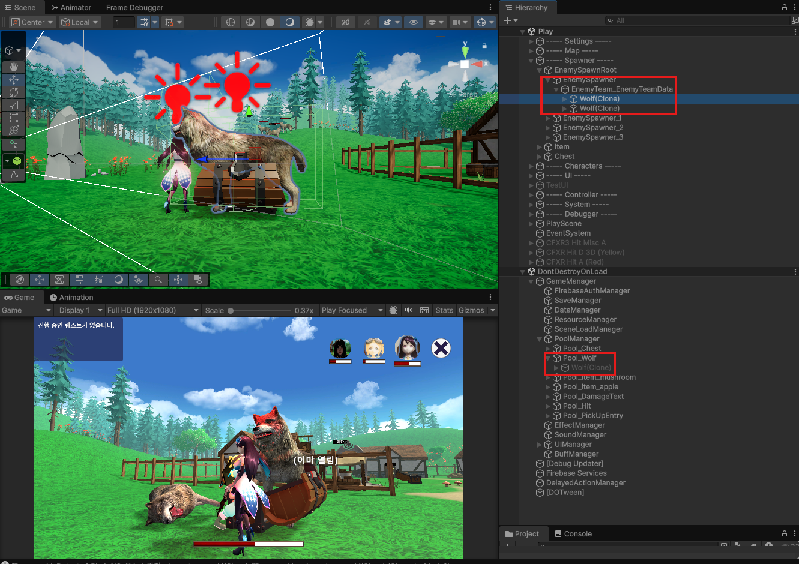</td>
<td><strong>♻️ 리스폰 생성</strong><br>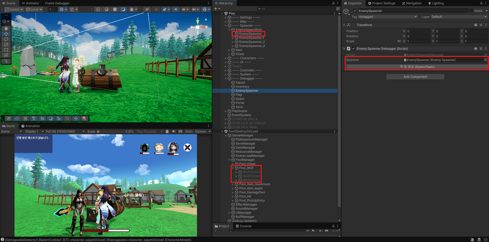</td>
</tr>
<tr>
<td colspan="2"><strong>🔄 풀링 재사용</strong><br>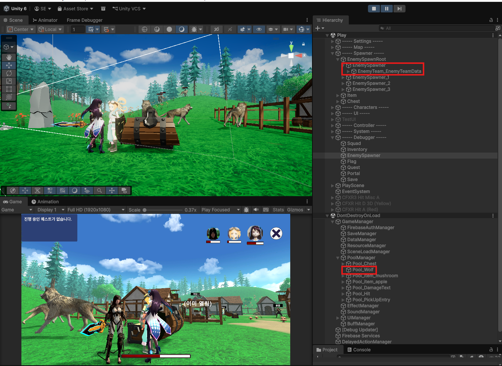</td>
</tr>
</table>

**시스템 특징**
- **오브젝트 풀링**: `PoolManager`를 통한 적 재사용으로 메모리 할당 최소화
- **데이터 기반 스폰**: `EnemySpawner`가 ID로 적 데이터를 동적 로드하여 생성
- **성능 안정화**: `Instantiate/Destroy` 반복 제거로 프레임 드랍 방지
- **지능형 AI**: 어그로 시스템 기반 타겟팅과 상태 머신 패턴 전투
- **전투 연동**: 처치 시 퀘스트 자동 진행 및 보상 시스템 연동

**주요 컴포넌트**
- `Enemy`: 적의 기본 동작을 관리하는 컴포넌트, 체력, 공격력 등 핵심 스탯
- `EnemySpawner`: 적 생성 및 리스폰 관리, 위치와 타이밍 제어
- `PoolManager`: 오브젝트 풀링 시스템, 적 생성/파괴 최적화
- `EnemyData`: ScriptableObject 기반 적 데이터, 스탯, 드롭 아이템 정보
- `AIBrain`: 적 AI 동작 제어, 추적, 공격, 도주 패턴 결정

#### 3.3 대화 및 퀘스트 시나리오 연동 (Flag-Driven)

<table>
<tr>
<td><strong>💬 대화 시스템</strong><br></td>
<td><strong>🎯 퀘스트 완료</strong><br>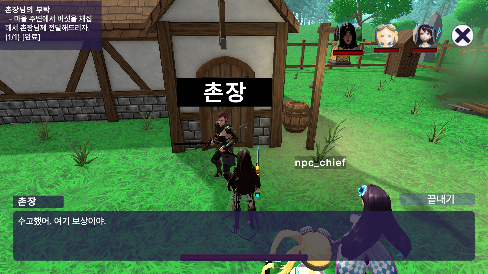</td>
</tr>
</table>

**시스템 특징**
- **플래그 기반**: `FlagSystem`으로 대화와 퀘스트 유기적 연동
- **시나리오 분기**: `DialogueData(SO)`의 플래그 조건으로 실시간 대사 변화
- **확장성**: ScriptableObject 설정만으로 복잡한 조건부 시나리오 구성
- **이벤트 연동**: 대화 선택 결과가 게임 상태를 즉시 반영
- **조건부 진행**: 특정 플래그 달성 시 새로운 대화 옵션 해금
- **분대원 영입**: 퀘스트 완료 시 플래그를 통해 NPC 분대 자동 추가

**주요 컴포넌트**
- `DialogueData`: 대화 내용과 플래그 조건을 담는 ScriptableObject, 선택지와 결과 정의
- `FlagSystem`: 게임 상태를 관리하고 대화 분기를 제어, 플래그 값 변경 감지
- `QuestController`: 플래그 변화를 감지하고 퀘스트 진행을 처리, 보상 및 영입 시스템 연동
- `DialogueView`: UI 표시 및 사용자 입력 처리, 대화창 렌더링

---

### 3.B 지원 시스템 및 유틸리티 (Supporting Systems & Utilities)

#### 3.4 인벤토리 시스템 (MVP Pattern)

<table>
<tr>
<td><strong>🎒 인벤토리 구조</strong><br>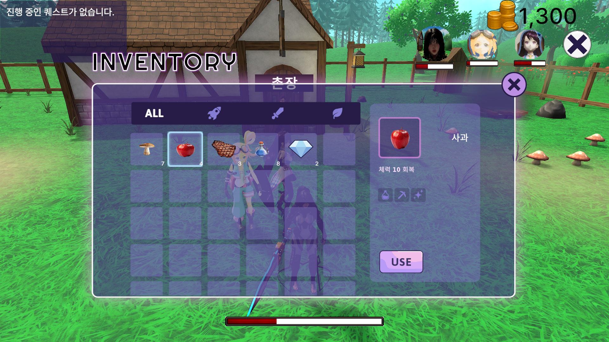</td>
<td><strong>🎯 MVP 패턴</strong><br>MVP 패턴 기반의 인벤토리 시스템으로 데이터와 UI의 완벽한 분리를 구현합니다.</td>
</tr>
</table>

**시스템 특징**
- **MVP 패턴**: 데이터(Inventory)와 UI(View)를 Presenter가 중개
- **관심사 분리**: UI 수정이 비즈니스 로직에 영향 주지 않음
- **동적 대상 적용**: 분대원 교체 시 아이템 사용 대상 실시간 갱신
- **데이터 무결성**: Presenter를 통한 일관된 상태 관리
- **확장성**: 새로운 아이템 타입과 기능 쉽게 추가 가능
- **테스트 용이성**: Model과 View 분리로 단위 테스트 수월

**주요 컴포넌트**
- `Inventory`: 아이템 데이터와 상태를 관리하는 Model, 아이템 추가/제거/검색
- `InventoryView`: UI 표시와 사용자 입력을 처리하는 View, 슬롯 렌더링 및 이벤트 수신
- `InventoryPresenter`: Model과 View를 연결하고 비즈니스 로직 처리, 아이템 사용 및 상태 동기화
- `ItemData`: ScriptableObject 기반 아이템 정보, 아이콘, 이름, 효과 정의

#### 3.5 스마트 지도 및 포탈 시스템

<table>
<tr>
<td><strong>🗺️ 지도 시스템</strong><br></td>
<td><strong>� 포탈 시스템</strong><br>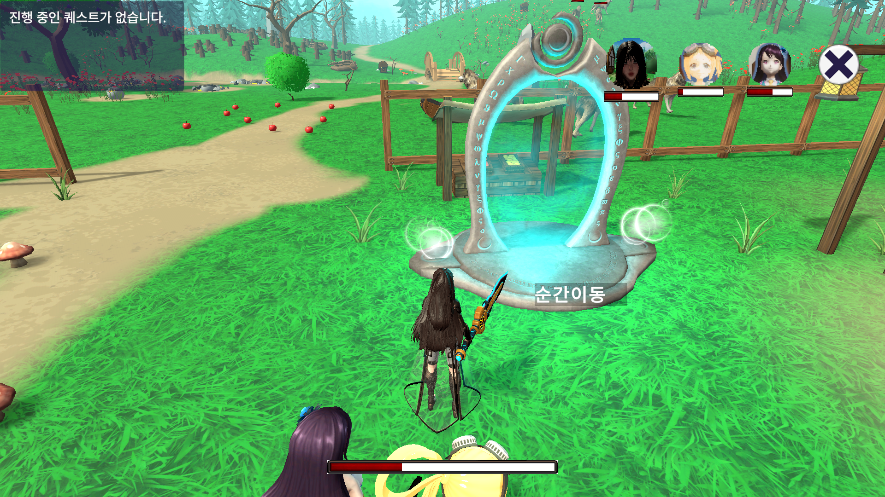</td>
</tr>
</table>

**시스템 특징**
- **실시간 미니맵**: 전용 카메라와 `RenderTexture`를 활용해 현재 지형과 위치를 실시간으로 투영
- **전역 순간이동**: 해금된 포탈을 시각적으로 표시하고 클릭 시 분대 전체 위치 즉시 이동
- **동적 줌/스크롤**: 사용자 편의를 위한 맵 확대/축소 및 이동 기능
- **포탈 상태 관리**: 해금 상태에 따른 포탈 시각적 표시 및 상호작용 제어
- **위치 보정**: 순간이동 시 분대원들의 위치 충돌 방지 및 적절한 배치

**주요 컴포넌트**
- `MapRenderer`: 실시간 미니맵 렌더링, 카메라 제어 및 RenderTexture 업데이트
- `PortalManager`: 포탈 상태 관리, 해금 조건 확인 및 순간이동 실행
- `MapController`: 지도 UI 제어, 줌/스크롤 입력 처리 및 상호작용

#### 3.6 모듈형 UI 연출 시스템 (Tween Facade)

<table>
<tr>
<td><strong>🎨 UI 연출 시스템</strong><br>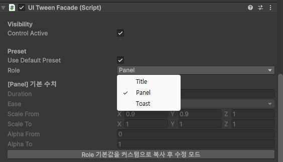</td>
<td><strong>🎯 시스템 개요</strong><br>
DOTween 기반의 모듈형 UI 연출 시스템으로 일관되고 몰입감 있는 UI 효과를 제공합니다.</td>
</tr>
</table>

**시스템 특징**
- **UITweenFacade**: 모든 UI 요소에 공통으로 적용 가능한 등장/퇴장 연출 인터페이스 제공
- **Preset 기반 관리**: UI 역할별로 최적화된 연출 수치를 프리셋으로 관리
- **일관성 유지**: 프로젝트 전체의 UI 애니메이션 스타일 통일
- **성능 최적화**: DOTween의 효율적인 트윈 처리로 부하 최소화
- **확장성**: 새로운 연출 효과와 프리셋 쉽게 추가 가능
- **코드 단순화**: 한 줄의 코드로 복잡한 UI 애니메이션 실행

**주요 컴포넌트**
- `UITweenFacade`: UI 연출을 필요로 하는 컴포넌트에 달아서 사용할 수 있는 인터페이스
- `TweenPreset`: 연출 설정에 따른 프리셋을 미리 저장

**구현된 프리셋 종류**
- **TitlePreset**: 타이틀 등장 연출
- **PanelPreset**: 패널 등장/퇴장 연출 (페이드인/아웃 + 스케일 효과)
- **ToastPreset**: 토스트 메시지 연출 (짧은 알림 메시지 표시)

**핵심 코드**
```csharp
// UITweenFacade를 통한 간단한 연출 실행
UITweenFacade facade = GetComponent<UITweenFacade>();
facade.PlayEnter();  // 등장 연출
facade.PlayExit();   // 퇴장 연출
```

#### 3.7 사운드 및 이펙트 관리 시스템

<table>
<tr>
<td><strong>🔊 사운드 및 이펙트</strong><br>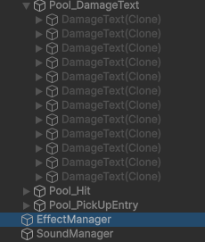</td>
<td><strong>🎯 시스템 개요</strong><br>
중앙 집중식 매니저를 통해 시각/청각 피드백을 효율적으로 관리하는 통합 시스템입니다.</td>
</tr>
</table>

**시스템 특징**
- **중앙 집중 관리**: EffectManager와 SoundManager로 모든 피드백 통합 제어
- **풀링 기반 이펙트**: PoolManager와 연동하여 타격 이펙트, 데미지 텍스트 재사용
- **이벤트 기반 발행**: PlaySceneEventHub를 통해 전투 이벤트 자동 감지 및 효과 발행
- **성능 최적화**: 오브젝트 풀링과 이벤트 시스템으로 런타임 부하 최소화

**주요 컴포넌트**
- `EffectManager`: 시각 효과 관리, PoolManager와 연동한 이펙트 생성/파괴
- `SoundManager`: 사운드 재생 관리, 2D/3D 오디오 통합 제어 및 볼륨 조절
- `PlaySceneEventHub`: 전투 이벤트 감지, 적 처치/데미지/스킬 사용 등 이벤트 발행


### 4. 부록


## 아트 및 리소스

#### 🎭 캐릭터 및 몬스터
| 에셋 (폴더) | 사용 용도 |
|-------------|-----------|
| FemaleAssasin | 캐릭터 모델 |
| FemaleCharacter | 캐릭터 모델 |
| Monster_Wolf | 늑대 몬스터 |
| Picola | 캐릭터 모델 |
| SapphiArt | 캐릭터 모델 |

#### 🌍 환경 및 맵
| 에셋 (폴더) | 사용 용도 |
|-------------|-----------|
| Town | 마을 건물 및 구조물 |
| Lowpoly_Village | 마을 환경 |
| Lowpoly_Environments | 환경 오브젝트 |
| Lowpoly_Demos | 맵 에셋 |

#### ⚔️ 무기 및 오브젝트
| 에셋 (폴더) | 사용 용도 |
|-------------|-----------|
| Sci-fi Sword | 무기 |
| Stylized Fantasy Weapons Pack | 무기 |
| Chest | 보물 상자 |
| FREE Food Pack | 음식 아이템 |
| Fruits and Vegetables | 과일 및 채소 |

#### ✨ 이펙트 및 VFX
| 에셋 (폴더) | 사용 용도 |
|-------------|-----------|
| Cartoon FX Remaster | 카툰 스타일 이펙트 |
| RunesAndPortals | 포탈 이펙트 |
| Trail | 트레일  |
| RainbowTrail | 트레일 |

#### 🎨 UI 및 인터페이스
| 에셋 (폴더) | 사용 용도 |
|-------------|-----------|
| Classic_RPG_GUI | UI |
| Space_Exploration_GUI_Kit | UI |

---

## 🚀 로드맵 (Roadmap)

### 📅 Short-term (1주) - Phase 2 마무리
| 우선순위 | 기능 | 목표 |
|:--------:|------|------|
| 🔥 | 퀘스트 목록 창 | 수락/진행/완료 퀘스트 종합 관리 |
| 🔥 | 캐릭터 상태창 | 레벨/스탯/장비 확인용 UI |
| ⭐ | 레벨업 UI 마무리 | 제단(Altar) 뷰 완성 및 피드백 |

### 📅 Mid-term (1개월) - Phase 2 심화
| 우선순위 | 기능 | 목표 |
|:--------:|------|------|
| 🔥 | 장비 착용/해제 시스템 | EquipmentItemData 활용 성장 요소 |
| ⭐ | 캐릭터 대시(Dash) | 전투 쾌감 및 기동성 향상 |
| ⭐ | 스킬 시스템 + 쿨다운 UI | 전투 전략성 및 깊이 추가 |

### 📅 Future - Phase 3
- 튜토리얼 및 가이드 시스템
- 추가 캐릭터 및 적 몬스터
- 설정 저장 (사운드, 키 바인딩)
- 멀티플레이어 기능 고려

---

## 🛠️ 개발 환경

### ⚙️ 기술 스택
| 카테고리 | 기술 | 버전 | 목적 |
|---------|------|------|------|
| **엔진** | Unity | 6000.3.10f1 | 3D 게임 개발 |
| **IDE** | Visual Studio | 2022 | C# 개발 |
| **버전 관리** | Git/GitHub | - | 소스 코드 관리 |
| **AI 도구** | Trae IDE, Cursor | - | 개발 보조 |

### 📦 주요 라이브러리
| 라이브러리 | 버전 | 용도 |
|------------|------|------|
| **DOTween** | 1.2.765 | UI/게임 오브젝트 트윈 애니메이션 |
| **Cinemachine** | 3.1.5 | 3인칭 카메라 시스템 |
| **Firebase SDK** | Latest | 인증 및 클라우드 데이터베이스 |

### 🎯 Unity 패키지
| 패키지 | 목적 |
|--------|------|
| **Addressables** | 비동기 에셋 관리 및 메모리 최적화 |
| **AI Navigation** | NavMesh 기반 지능형 길찾기 |
| **Input System** | 통합 입력 장치 처리 |
| **Universal RP** | 고성능 렌더링 파이프라인 |

---

## 📞 연락처

**개발자**: 김선식 
**이메일**: [endkss@gmail.com]
**연락처**: 010-2549-5970  
**GitHub**: [https://github.com/ProgramingLanguageStudy](https://github.com/ProgramingLanguageStudy)

---

> ⭐ **Project Starfall**은 객체지향 설계와 최신 Unity 기술을 활용한 확장 가능한 RPG입니다.  
> 지속적인 개선과 확장을 통해 완성도 높은 게임으로 발전해 나가고 있습니다.
