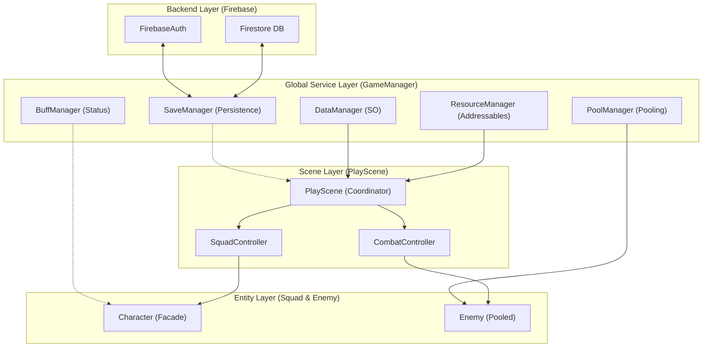
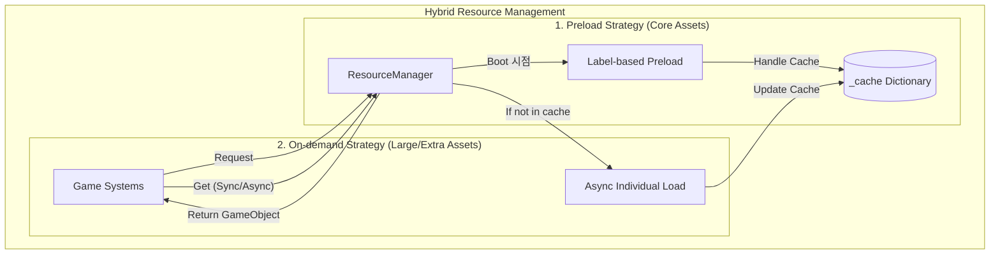
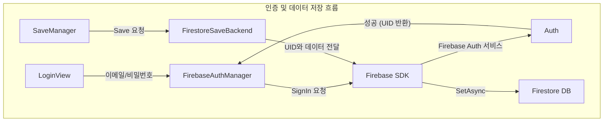
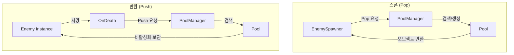
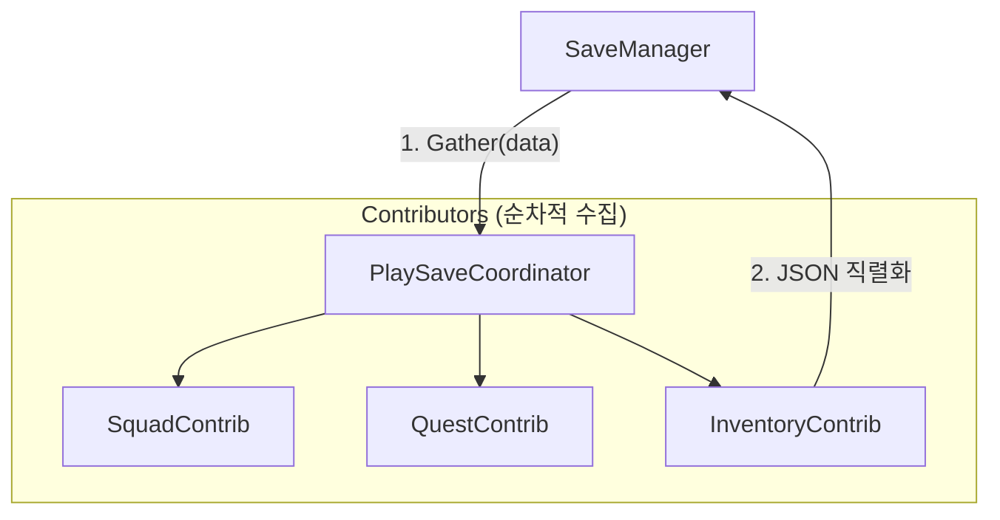
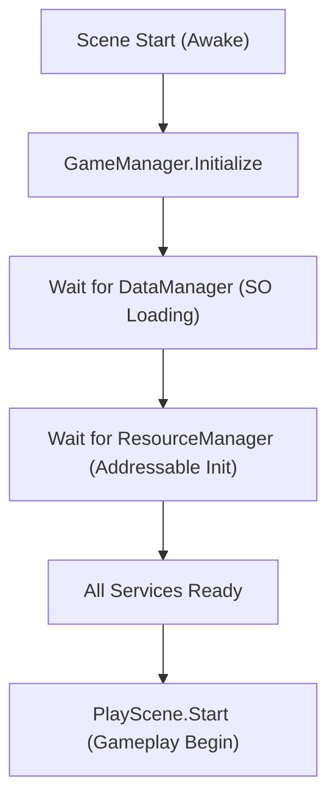
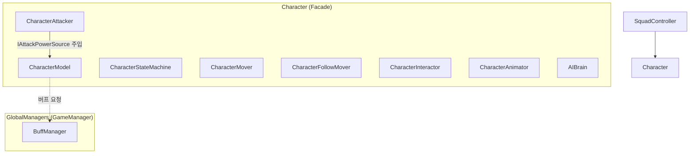

# Squad System Framework

> 분대 시스템 기반 3인칭 RPG 개발 문서

---

## 1. 프로젝트 소개

### 1.1 게임 개요

**Squad System Framework**는 **분대 시스템 기반 3인칭 RPG 프레임워크**입니다. 
단순한 기능 구현을 넘어, **객체지향 설계(OOP)**와 **데이터 기반 디자인(Data-Driven Design)**을 통해 콘텐츠 확장성과 시스템 유지보수성을 극대화하는 것을 목표로 제작되었습니다.

- **플레이어·동료 분대**: 한 명을 직접 조종하고, 나머지는 AI(AIBrain)가 상황에 맞춰 추적 및 전투를 수행하는 유기적인 분대 시스템
- **인증 및 클라우드 세이브**: **Firebase Auth**를 이용한 계정 관리와 **Firestore**를 통한 서버 기반 데이터 영속성 확보
- **비동기 에셋 관리**: **Addressables** 시스템을 도입하여 런타임 중 필요한 에셋만 동적으로 로드하고 메모리 점유율 최적화
- **고성능 오브젝트 풀링**: 적, 이펙트, 아이템 등 빈번한 생성/파괴가 일어나는 객체들을 **PoolManager**로 관리하여 성능 스파이크 방지
- **중앙 집중식 버프 관리**: **BuffManager**를 통해 모든 캐릭터의 상태 효과를 전역에서 조율하고 정밀한 시간 제어 및 세이브 데이터 연동 구현
- **분대 교체(Swap)**: 실시간으로 조종 대상을 순환 전환하며 각기 다른 캐릭터의 스탯과 스킬 활용 가능
- **동료 영입 및 시나리오**: 퀘스트 및 대화 시스템과 연동하여 특정 조건을 만족할 시 NPC를 분대에 영입하는 확장형 구조
- **지능형 적 AI**: 어그로 시스템 기반의 타겟팅, 상태 머신을 활용한 패턴 전투 및 처치 퀘스트 자동 연동
- **유연한 상호작용**: 대화, 인벤토리 등 RPG의 핵심 요소들을 모듈화하여 독립적인 컴포넌트로 구성
- **스마트 지도 및 포탈 시스템**: `RenderTexture` 기반의 실시간 지도, 줌/스크롤 기능 및 해금된 포탈을 통한 전역 순간이동(Fast Travel) 시스템
- **사망 및 리스폰**: 세이브 데이터와 연동된 부활 시스템 및 위치 보정 로직 포함

### 1.2 게임 이미지

<table>
<tr>
<td><strong>인트로</strong><br></td>
<td><strong>분대 따라오기</strong><br></td>
</tr>
<tr>
<td><strong>분대 전투</strong><br></td>
<td><strong>대화·퀘스트</strong><br></td>
</tr>
<tr>
<td><strong>동료 영입 완료</strong><br></td>
<td><strong>인벤토리</strong><br></td>
</tr>
<tr>
<td><strong>지도</strong><br></td>
<td><strong>포탈</strong><br></td>
</tr>
</table>

### 1.3 영상

[🎬 영상 보기](https://youtu.be/l2WycMeBfec)

### 1.4 게임 빌드 파일

[ 구글 드라이브 링크](https://drive.google.com/file/d/1W-kQanPIanT2rcA6QPB2fi-XtjkgfTfw/view?usp=drive_link)

---

## 2. 핵심 기술 및 아키텍처

### 2.0 전체 시스템 아키텍처 (Overall Architecture)

본 프레임워크는 **싱글톤 기반의 전역 매니저(Global Managers)**와 **씬별 조율자(Scene Coordinators)**, 그리고 **독립적인 엔티티(Entities)**가 유기적으로 통신하는 구조로 설계되었습니다. 모든 핵심 시스템은 인터페이스를 통해 결합도를 낮추어 확장성을 확보했습니다.

#### 시스템 계층 도식



**아키텍처 핵심 원칙**
1.  **Centralized Management**: `GameManager`가 데이터, 리소스, 세이브 등 전역 서비스를 통합 관리하여 시스템 응집도를 높였습니다.
2.  **Decoupled Entities**: 각 캐릭터와 적은 매니저를 직접 참조하지 않고, 인터페이스나 이벤트를 통해 통신하여 개별 클래스의 독립성을 유지합니다.
3.  **Data-Driven Flow**: 모든 에셋 생성과 스탯 설정은 `DataManager`를 통해 흐르며, 코드 수정 없이 콘텐츠를 확장할 수 있습니다.

---

### 2.1 하이브리드 Addressables 콘텐츠 관리 (Preload & On-demand Ready)

| 구분 | 내용 |
|------|------|
| **문제** | 모든 에셋을 처음에 로드하면 메모리 낭비가 심하고, 반대로 매번 비동기 로드만 하면 런타임 성능 저하(Stuttering)가 발생할 수 있음. |
| **해결** | **하이브리드 아키텍처** 설계. 현재는 성능 안정성을 위해 핵심 프리팹을 라벨 기반으로 프리로드(Preload)하여 동기식(`GetPrefab`)으로 즉시 사용하며, 향후 대규모 에셋 확장을 대비해 온디맨드 비동기 로드(`GetPrefabAsync`) 인터페이스를 선제적으로 구축. |
| **결과** | 최적의 메모리 점유율 유지 및 런타임 성능 확보, 향후 에셋 규모 확장에 유연하게 대응 가능한 확장성 확보. |

#### 도식



**핵심 코드**

```csharp
// ResourceManager.cs - 하이브리드 접근 방식
// 1. 캐시된 에셋 즉시 반환 (프리로드 된 경우)
public GameObject GetPrefab(string category, string name) { ... }

// 2. 캐시에 없으면 비동기 로드 후 반환 (On-demand 확장)
public async Task<GameObject> GetPrefabAsync(string category, string name)
{
    var key = $"{category}/{name}";
    if (_cache.TryGetValue(key, out var handle)) return handle.Result;

    var loadHandle = Addressables.LoadAssetAsync<GameObject>(address);
    await loadHandle.Task;
    _cache[key] = loadHandle;
    return loadHandle.Result;
}
```

---

### 2.2 Firebase 백엔드 연동 (인증 & 클라우드 저장)

| 구분 | 내용 |
|------|------|
| **문제** | 로컬 세이브는 기기 분실 시 데이터가 유실되며, 여러 기기에서 동일한 계정으로 플레이할 수 없음. |
| **해결** | **인증**: `FirebaseAuthManager`를 구현하여 이메일/비밀번호 기반 로그인 시스템 구축.<br>**서버 저장**: `FirestoreSaveBackend`를 구현하여 유저 UID별로 세이브 데이터를 Firestore에 JSON 형태로 저장. |
| **결과** | 유저 데이터의 영속성 확보 및 서버 기반의 안정적인 데이터 관리 체계 구축. |

#### 도식



---

### 2.3 고성능 오브젝트 풀링 시스템

| 구분 | 내용 |
|------|------|
| **문제** | 전투 중 대량의 적, 이펙트가 반복적으로 생성/파괴되면서 발생하는 CPU 부하 및 GC 스파이크로 인한 프레임 드랍. |
| **해결** | `PoolManager`를 통한 객체 재사용 로직 구현. `Poolable` 컴포넌트를 통해 객체 상태를 리셋하고, 런타임 중 `Instantiate` 호출을 최소화. |
| **결과** | 빈번한 전투 상황에서도 안정적인 프레임 유지 및 메모리 관리 효율 극대화. |

#### 도식



---

### 2.4 데이터 기반 시스템 확장 (Data-Driven Design)

| 구분 | 내용 |
|------|------|
| **문제** | 새로운 적이나 아이템을 추가할 때마다 코드를 수정하거나 씬의 스포너에 프리팹을 직접 할당해야 하는 번거로움과 오류 가능성. |
| **해결** | 모든 콘텐츠를 `BaseData(SO)`로 규격화하고 `DataManager`에서 통합 관리. 스포너는 문자열 ID만 알고 있으면 `ResourceManager`와 연동하여 데이터와 에셋을 동적으로 매칭. |
| **결과** | 기획자가 코드 수정 없이 데이터 시트(SO) 설정만으로 새로운 콘텐츠를 즉시 게임에 반영할 수 있는 확장성 확보. |

#### 도식


**핵심 코드**

```csharp
// DataManager.cs - 제네릭 데이터 조회
public T Get<T>(string id) where T : BaseData
{
    var category = typeof(T).Name;
    if (typeof(ItemData).IsAssignableFrom(typeof(T))) category = "ItemData";
    
    var key = $"{category}/{id}";
    return _cache.TryGetValue(key, out var cached) ? cached as T : null;
}
```

---

### 2.5 모듈형 세이브 컨트리뷰터 (Contributor Pattern)

| 구분 | 내용 |
|------|------|
| **문제** | 세이브 항목(인벤토리, 퀘스트, 위치 등)이 늘어날수록 `SaveManager`의 코드가 비대해지고 시스템 간 결합도가 높아짐. |
| **해결** | `ISaveContributor` 인터페이스 도입. 각 시스템이 자신의 데이터만 관리하도록 분리하고, `SaveManager`는 이들을 순회하며 데이터를 수집/배포하는 역할만 수행. |
| **결과** | 새로운 저장 항목 추가 시 기존 코드를 건드리지 않고 새로운 Contributor만 추가하면 되는 개방-폐쇄 원칙(OCP) 준수. |

#### 도식



**핵심 코드**

```csharp
// ISaveContributor.cs - 인터페이스 정의
public interface ISaveContributor
{
    string Key { get; }
    void Gather(SaveData data);
    void Spread(SaveData data);
}

// SquadSaveContributor.cs - 구체적 구현 예시
public class SquadSaveContributor : SaveContributorBehaviour, ISaveContributor
{
    public string Key => "Squad";
    public void Gather(SaveData data) => data.squad = _squad.GetSaveData();
    public void Spread(SaveData data) => _squad.LoadSaveData(data.squad);
}
```

---

### 2.6 안전한 씬 초기화 파이프라인 (Safe Boot Sequence)

| 구분 | 내용 |
|------|------|
| **문제** | 씬 로딩 시 시스템 초기화 순서가 꼬여 `NullReferenceException`이 발생하거나, 글로벌 매니저가 준비되기 전에 로직이 실행되는 문제. |
| **해결** | `PlayScene` 시작 시 `GameManager`의 모든 서비스(Data, Pool, Resource)가 로딩될 때까지 코루틴으로 안전하게 대기하는 부트 시퀀스 구축. |
| **결과** | 비동기 로딩 환경에서도 시스템 간 의존성 순서를 보장하여 런타임 안정성 획득. |

#### 도식



**핵심 코드**

```csharp
// PlayScene.cs - 부트 시퀀스 대기 로직
private IEnumerator WaitForBootThenInitializeRoutine()
{
    // GameManager 서비스가 모두 준비될 때까지 대기
    while (!GameManager.Instance.BootServicesReady)
    {
        yield return null;
    }

    // 준비 완료 후 씬 시스템 초기화
    Initialize();
}
```

---

## 3. 주요 시스템 구현 (Feature Implementation)

> 위에서 구축한 핵심 아키텍처를 바탕으로 구현된 구체적인 게임 기능들입니다.

### 3.1 분대 및 캐릭터 시스템

Character는 **독립적인 컴포넌트 조합**으로 설계되어 있으며, `Character` 파사드 클래스를 통해 모든 명령(Request API)이 조율됩니다.

#### 도식



**핵심 설계**
*   **컴포넌트 독립성**: `CharacterAttacker`는 부모 클래스를 직접 참조하는 대신 `IAttackPowerSource` 인터페이스를 주입받아 완벽하게 독립적으로 작동합니다.
*   **이벤트 기반 연동**: `Update()`를 통한 폴링 대신 상태 변경 이벤트를 구독하여 애니메이션과 버프 상태를 업데이트함으로써 CPU 효율을 높였습니다.

---

### 3.2 지능형 동료 AI (AIBrain)

플레이어의 입력을 대신하여 상황에 맞는 최적의 판단을 내리는 시스템입니다.

| 구분 | 내용 |
|------|------|
| **문제** | 동료가 플레이어처럼 입력을 받지 않아, 전투 시 추적·사거리 판단·공격 시점을 자동으로 결정해야 함 |
| **해결** | `IsInCombat` 상태에 따라 `TickFollow`(추적)와 `TickCombat`(전투) 로직으로 분기. 타겟과의 거리와 공격 사거리를 계산하여 `Character` 파사드에 이동/공격 요청을 전달. |
| **결과** | 플레이어와 동일한 상태 머신을 공유하면서도, 지능적인 자율 행동이 가능한 동료 시스템 구현. |

---

### 3.3 전투 및 적 시스템

오브젝트 풀링과 데이터 기반 스폰이 결합된 고성능 전투 시스템입니다.

*   **풀링 기반 스폰**: `EnemySpawner`가 `PoolManager`를 통해 적을 생성하고, 사망 시 3초 후 자동으로 풀에 반환합니다. 이는 런타임 중 `Instantiate/Destroy` 호출을 최소화하여 프레임 드랍을 방지합니다.
*   **어그로 시스템**: 거리별 어그로 누적을 통해 가장 위협적인 대상을 우선 공격하도록 설계되었습니다.
*   **유연한 스포너**: 문자열 ID만으로 적의 종류를 결정하므로, 데이터 수정만으로 배치 구성을 즉시 변경할 수 있습니다.

---

### 3.4 대화 및 퀘스트 시나리오 연동

**플래그 시스템(FlagSystem)**을 중심으로 대화와 퀘스트가 유기적으로 연결됩니다.

*   **시나리오 분기**: `DialogueData(SO)`에 설정된 플래그 조건에 따라 NPC의 대사가 실시간으로 변화합니다.
*   **퀘스트 연동**: 대화 종료 시 특정 플래그를 세팅하여 퀘스트를 수락하거나, 조건 달성 여부를 확인하여 보상을 지급합니다.
*   **동료 영입**: 특정 퀘스트 완료 플래그를 감지하여 NPC를 분대원(`AddCompanion`)으로 즉시 합류시키는 동적 시나리오를 지원합니다.

---

### 3.5 인벤토리 시스템

*   **MVP 패턴**: 데이터(Inventory)와 UI(View)를 `Presenter`가 중개하여 로직과 표현을 엄격히 분리했습니다.
*   **동적 대상 적용**: 플레이어가 조종하는 캐릭터가 바뀌면 아이템 사용 대상(`ItemUser`)도 실시간으로 갱신됩니다.

---

### 3.6 스마트 지도 및 포탈 시스템

*   **실시간 미니맵**: 전용 카메라와 `RenderTexture`를 사용하여 현재 지형을 실시간으로 투영합니다.
*   **전역 순간이동**: `FlagSystem`과 연동되어 해금된 포탈만 지도에 표시되며, 클릭 시 분대 전체가 해당 위치로 즉시 이동합니다.

---

## 4. 부록: 사용 에셋

본 프로젝트에서 사용한 Asset Store 에셋 목록

| 에셋 (폴더) | 사용 용도 |
|-------------|-----------|
| FemaleAssasin | 캐릭터 모델·애니메이션 |
| PicoChan | 캐릭터 모델 |
| SapphiArtchan | 캐릭터 모델 |
| Stellar Girl Celeste | 캐릭터 모델 |
| Monster_Wolf | 적(늑대) 모델 |
| Space_Exploration_GUI_Kit | UI (인벤토리, 퀘스트 등) |
| Classic_RPG_GUI | UI 부품 |
| RunesAndPortals | 포탈·이펙트 |
| Town | 마을 맵·환경 |
| Lowpoly_Environments | 맵·환경 |
| Lowpoly_Demos | 데모 맵 |
| Lowpoly_Village | 마을 오브젝트 |
| Fruits and Vegetables | 오브젝트 |
| FREE Food Pack | 음식 오브젝트 |
| Sci-fi Sword | 무기 |
| Stylized Fantasy Weapons Pack | 무기 모델 |
| CharacterAnimation / Human Animations | 애니메이션 |
| DOTween (Plugins) | 트윈 애니메이션 |

---

## 5. 사용 Tool 및 환경

### 5.1 개발 환경
| Tool | 버전/내용 |
|------|-----------|
| **Unity** | 6000.0.59f2 (Unity 6) |
| **Trae IDE** | AI 보조를 통한 아키텍처 리팩토링 및 코드 품질 관리 |
| **Git** | 프로젝트 버전 관리 및 협업 |

**주요 패키지**
| 패키지 | 용도 |
|------|------|
| **Addressables** | 비동기 콘텐츠 관리 및 원격 에셋 업데이트 |
| **Firebase SDK** | 사용자 인증 및 클라우드 데이터베이스(Firestore) 연동 |
| **AI Navigation** | NavMesh 기반의 지능형 길찾기 및 장애물 회피 |
| **Cinemachine** | 3인칭 숄더뷰 및 컷신 카메라 워킹 |
| **Universal RP** | 고성능 렌더링 파이프라인 적용 |

---

### 참고

- **Repository**: https://github.com/ProgramingLanguageStudy/Squad_System_Framework
