# Squad System Framework

> 분대 시스템 기반 3인칭 RPG 개발 문서

---

## 1. 프로젝트 소개

### 1.1 게임 개요

**Squad System Framework**는 **분대 시스템 기반 3인칭 RPG 프레임워크**입니다.

- **플레이어·동료 분대**: 한 명을 조종하고, 나머지는 AI가 따라오며 전투에 참여
- **분대 교체(Swap)**: 조종 대상을 순환 전환
- **동료 영입**: 퀘스트 완료 시 NPC를 분대에 영입
- **적 전투**: 분대 vs 적 팀, 어그로, 처치 퀘스트 연동
- **대화**: NPC 상호작용, 플래그 기반 대화 분기
- **퀘스트**: 수집·처치·영입, 진행도·완료 분기
- **인벤토리**: 아이템 수집·보관
- **아이템 사용**: 회복 아이템 등, 조종 중인 캐릭터에 적용
- **포탈·맵**: 근접 이펙트, 해금 아이콘 표시, 지도 클릭 순간이동, 스크롤·줌
- **사망·리스폰**: 마을 고정 위치에서 부활
- **세이브/로드**: 분대 구성, 퀘스트, 인벤토리, 플래그, 캐릭터 위치·조종 캐릭터 저장

### 1.2 게임 이미지

<table>
<tr>
<td><strong>인트로</strong><br></td>
<td><strong>분대 따라오기</strong><br></td>
</tr>
<tr>
<td><strong>분대 전투</strong><br></td>
<td><strong>대화·퀘스트</strong><br></td>
</tr>
<tr>
<td><strong>동료 영입 완료</strong><br></td>
<td><strong>인벤토리</strong><br></td>
</tr>
<tr>
<td><strong>지도</strong><br></td>
<td><strong>포탈</strong><br></td>
</tr>
</table>

### 1.3 영상

[🎬 영상 보기](https://youtu.be/l2WycMeBfec)

### 1.4 게임 빌드 파일

[ 구글 드라이브 링크](https://drive.google.com/file/d/1W-kQanPIanT2rcA6QPB2fi-XtjkgfTfw/view?usp=drive_link)

---

## 2. 핵심 기술 항목

### 2.1 비동기 기반 Addressables 콘텐츠 관리

| 구분 | 내용 |
|------|------|
| **문제** | 모든 에셋(프리팹, 데이터 등)을 빌드에 포함하면 앱 용량이 커지고, 업데이트 시 앱 전체를 다시 빌드해야 하는 비효율성. |
| **해결** | Addressable Asset System을 도입하여 주요 에셋을 원격으로 관리. `ResourceManager`를 통해 비동기 로딩(`LoadAssetAsync`)을 구현하여, 필요할 때만 에셋을 다운로드하거나 캐시에서 로드. |
| **결과** | 앱 초기 빌드 용량 최소화, 콘텐츠 업데이트 시 앱 재빌드 불필요, 메모리 관리 효율성 증대. |

#### 도식

```mermaid
flowchart TD
    subgraph "에셋 로딩 흐름"
        Loader["ResourceManager"]
        Addressables["Addressables.LoadAssetAsync(key)"]
        Cache["로컬 캐시"]
        Remote["원격 서버 (CDN)"]
        Asset["로드된 에셋 (프리팹 등)"]
    end

    Loader -->|1. 에셋 요청| Addressables
    Addressables -->|2. 캐시 확인| Cache
    Cache -- "캐시 있음" --> Asset
    Cache -- "캐시 없음" -->|3. 원격 다운로드| Remote
    Remote -->|4. 캐시에 저장| Cache
    Addressables -->|5. 비동기 반환| Loader
```

**핵심 코드**

```csharp
// ResourceManager.cs - 비동기 프리팹 로딩
public async Task<GameObject> GetPrefab(string key)
{
    if (_prefabs.TryGetValue(key, out var prefab))
        return prefab;

    var handle = Addressables.LoadAssetAsync<GameObject>(key);
    await handle.Task;

    if (handle.Status == AsyncOperationStatus.Succeeded)
    {
        _prefabs[key] = handle.Result;
        return handle.Result;
    }
    else
    {
        Debug.LogError($"[ResourceManager] Prefab 로드 실패: {key}");
        return null;
    }
}
```

---

### 2.2 Firebase를 이용한 백엔드 연동 (인증 & Firestore 저장)

| 구분 | 내용 |
|------|------|
| **문제** | 로컬 세이브는 기기 분실 시 데이터가 유실되며, 여러 기기에서 동일한 계정으로 플레이할 수 없음. |
| **해결** | **인증**: `FirebaseAuthManager`를 구현하여 이메일/비밀번호 기반 회원가입 및 로그인 시스템 구축.<br>**서버 저장**: `SaveManager`에 `FirestoreSaveBackend`를 구현. 로그인된 사용자의 UID를 기준으로 세이브 데이터를 Firestore 데이터베이스에 JSON 형태로 저장 및 로드. |
| **결과** | 유저 데이터의 영속성 확보, 크로스 플랫폼 플레이 기반 마련, 서버 기반의 안정적인 데이터 관리 체계 구축. |

#### 도식

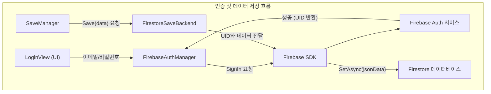

**핵심 코드**

```csharp
// FirestoreSaveBackend.cs - Firestore에 비동기 저장
public async Task<bool> Save(SaveData data)
{
    string userId = _authManager.UserId;
    if (string.IsNullOrEmpty(userId)) return false;

    var docRef = _db.Collection(SaveConfig.FirestoreCollectionName).Document(userId);
    string json = JsonUtility.ToJson(data);
    try
    {
        await docRef.SetAsync(json);
        return true;
    }
    catch (Exception e)
    {
        Debug.LogError($"[Firestore] Save failed: {e.Message}");
        return false;
    }
}
```

---

### 2.3 오브젝트 풀링을 통한 메모리 최적화

| 구분 | 내용 |
|------|------|
| **문제** | 전투 중 적, 이펙트, 아이템 등 수많은 오브젝트를 반복적으로 생성(`Instantiate`)하고 파괴(`Destroy`)하면서 발생하는 CPU 부하 및 가비지 컬렉션(GC) 스파이크. |
| **해결** | `PoolManager`를 구현하여 자주 사용하는 오브젝트를 미리 생성해두고 재활용. `Poolable` 컴포넌트를 통해 오브젝트의 상태를 리셋하고, 사용이 끝나면 다시 풀에 반환. |
| **결과** | 잦은 메모리 할당 및 해제로 인한 성능 저하를 방지하고, 부드러운 게임 플레이 경험을 제공. |

#### 도식

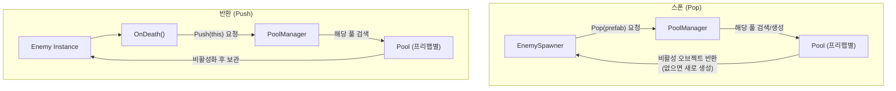

**핵심 코드**

```csharp
// PoolManager.cs - 오브젝트 풀에서 가져오기
public Poolable Pop(GameObject prefab, Vector3 position, Quaternion rotation)
{
    if (!_pools.TryGetValue(prefab, out var pool))
    {
        pool = new Pool(prefab, transform);
        _pools.Add(prefab, pool);
    }
    return pool.Pop(position, rotation);
}

// EnemySpawner.cs - 풀링된 적 스폰
private void SpawnEnemy(string enemyId, EnemyTeam team)
{
    var enemyData = GameManager.Instance.DataManager.Get<EnemyData>(enemyId);
    var prefab = await GameManager.Instance.ResourceManager.GetPrefab(enemyData.prefabKey);
    var enemyObject = GameManager.Instance.PoolManager.Pop(prefab);
    var enemy = enemyObject.GetComponent<Enemy>();
    enemy.ConfigureFromSpawn(enemyData, team);
}
```

---

### 2.4 분대·캐릭터 통합 상태머신

#### 도식

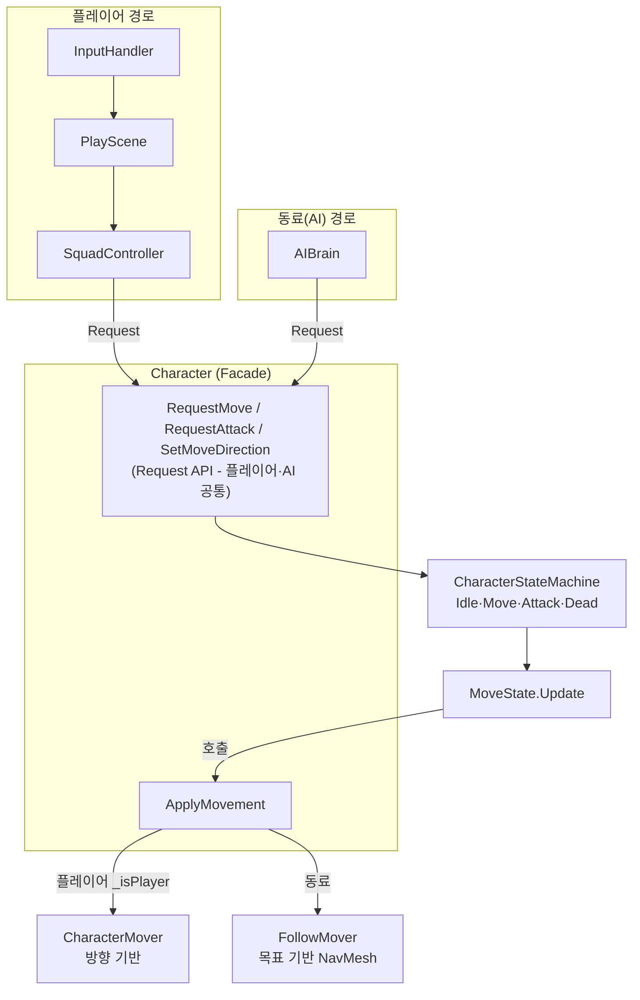

| 구분 | 내용 |
|------|------|
| **문제** | 1. 플레이어(방향 이동)와 동료(목표 추적)의 이동 방식이 달라, 동일한 StateMachine으로 통합하기 어려움<br>2. 모든 캐릭터가 각자 `Update()`를 통해 상태를 체크하여, 캐릭터 수가 늘어날수록 불필요한 CPU 부하 발생 |
| **해결** | 1. **실행부 분리**: 이동 실행부만 `CharacterMover`(방향)와 `CharacterFollowMover`(목표)로 분리하고, `ApplyMovement`에서 `_isPlayer`로 분기하여 해결.<br>2. **이벤트 기반 전환**: `Character.cs`의 `Update()`를 제거. `CharacterStateMachine`의 `OnStateChanged` 이벤트를 구독하여 상태가 변경될 때만 애니메이션을 갱신.<br>3. **중앙 관리**: 버프 등 주기적인 업데이트가 필요한 로직은 `BuffManager` 같은 중앙 관리자로 이전하여 개별 `Update()` 호출을 최소화. |
| **결과** | 하나의 `CharacterStateMachine`으로 플레이어·동료 모두 처리. 불필요한 `Update()` 호출을 제거하여 성능을 최적화하고, 이벤트 기반의 반응형 아키텍처 구축. |

**핵심 코드**

```csharp
// Character.cs - 이벤트 구독 및 핸들러
public void Initialize(/* ... */)
{
    // ...
    if (_stateMachine != null)
    {
        _stateMachine.OnStateChanged += HandleStateChanged;
    }
}

private void HandleStateChanged(CharacterState previous, CharacterState current)
{
    bool isMove = current == CharacterState.Move;
    _characterAnimator.SetMoving(isMove);
    float speed = isMove ? _model.CurrentMoveSpeed : 0f;
    _characterAnimator.Move(speed);
}

// Character.cs - 최적화된 ApplyMovement
public void ApplyMovement()
{
    if (_isPlayer)
    {
        _mover.Move(_currentMoveDirection);
        return;
    }
    
    if (_aiBrain != null && _aiBrain.CurrentTarget != null)
    {
        _followMover.MoveToTarget(_aiBrain.CurrentTarget.position, _aiBrain.CurrentStopDistance);
    }
}
```

---

### 2.2 AIBrain / 동료 AI

#### 도식

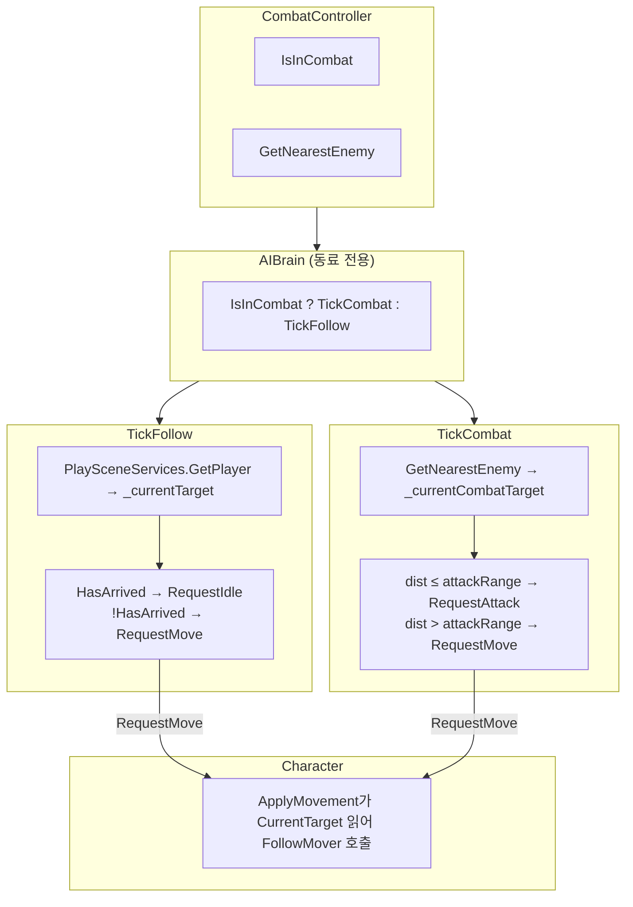

**SetFollowTarget**: SquadController가 플레이어 변경 시 Character → AIBrain.SetFollowTarget(플레이어) 호출. 따라갈 대상 설정.

| 구분 | 내용 |
|------|------|
| **문제** | 동료가 플레이어처럼 입력을 받지 않아, 전투 시 추적·사거리 판단·공격 시점을 자동으로 결정해야 함 |
| **해결** | CombatController(전투 상태, GetNearestEnemy) 기반 AIBrain. IsInCombat으로 TickFollow/TickCombat 분기. Follow 시 PlaySceneServices로 플레이어 획득, Combat 시 GetNearestEnemy로 타겟. 사거리 밖이면 RequestMove, 안이면 RequestAttack. Character.ApplyMovement가 CurrentTarget을 읽어 NavMesh 기반 FollowMover.MoveToTarget 호출 |
| **결과** | 플레이어와 동일한 CharacterStateMachine·Attacker 재사용. AIBrain은 “판단”만 담당, 실행은 Character에 위임 |

**핵심 코드**

```csharp
// AIBrain.cs - IsInCombat 분기
private void Update()
{
    if (_character == null || _character.Model == null || _character.Model.IsDead) return;
    if (_character.StateMachine?.CurrentState == CharacterState.Attack) return;

    bool isInCombat = _combatController != null && _combatController.IsInCombat;
    if (isInCombat) TickCombat();
    else TickFollow();
}

private void TickFollow()
{
    var player = PlaySceneServices.Player?.GetPlayer();
    _currentTarget = player != null ? player.transform : null;
    if (_currentTarget == null || HasArrived())
        _character?.RequestIdle();
    else
        _character?.RequestMove();
}

private void TickCombat()
{
    _currentCombatTarget = _combatController?.GetNearestEnemy(transform.position);
    if (_currentCombatTarget == null || _currentCombatTarget.Model.IsDead) return;
    _currentTarget = _currentCombatTarget.transform;
    float dist = Vector3.Distance(transform.position, _currentCombatTarget.transform.position);
    if (dist > _attackRange) _character?.RequestMove();
    else { _character?.RequestIdle(); _character?.RequestAttack(); }
}
```

---

### 2.3 시스템 간 독립성 (MVP + 조율층)

#### 도식

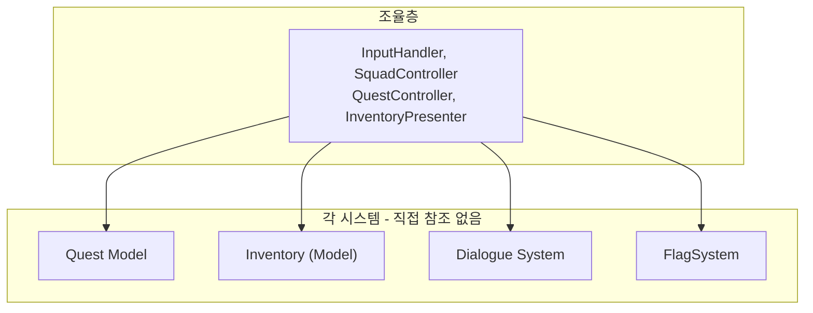

| 구분 | 내용 |
|------|------|
| **문제** | 퀘스트·인벤토리·대화가 서로 참조하면 결합도 증가, 수정 범위 확대 |
| **해결** | 퀘스트·인벤토리·대화는 Model/View 분리. PlayScene·PlaySaveCoordinator 등 조율층이 이벤트 구독 후 의존성 주입·호출 |
| **결과** | 퀘스트 추가·수정 시 인벤토리·대화 코드를 건드리지 않고 변경 가능 |

**핵심 코드**

```csharp
// PlayScene.cs - 조율층 Awake (시스템 연결·초기화)
private void Awake()
{
    _saveCoordinator?.Initialize(_squadController, _flagSystem, _questController?.Presenter, _inventoryPresenter?.Model);
    _pendingSaveData = GameManager.Instance?.SaveManager?.Load();
    var spawnPos = _pendingSaveData?.squad != null ? (Vector3?)_pendingSaveData.squad.playerPosition : null;

    _squadController.Initialize(spawnPos, _combatController, _pendingSaveData?.squad);
    PlaySceneServices.Register(_squadController);

    var player = _squadController.PlayerCharacter;
    _squadController.SetFollowTarget(player?.transform ?? transform);
    _inventoryPresenter?.SetPlayerCharacter(player);
    _dialogueController?.Initialize(_questController?.Presenter, _flagSystem);
    _questController?.Initialize(_inventoryPresenter?.Model, _flagSystem, _squadController);
    _mapController?.Initialize(_portalController, player, _squadController);
    _portalController?.Initialize(_mapController.MapView, _flagSystem);
}
```

---

### 2.4 세이브/로드 Contributor 패턴

#### 도식

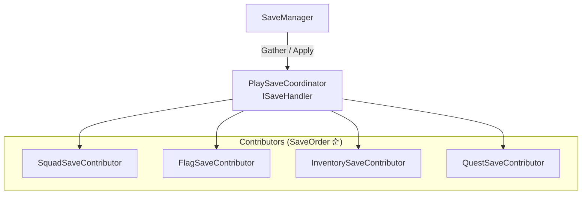

| 구분 | 내용 |
|------|------|
| **문제** | 세이브 대상이 늘어날 때마다 조율층이 모든 시스템을 알아야 함 |
| **해결** | `ISaveHandler` + `SaveContributorBehaviour` 기반. PlaySaveCoordinator가 Contributor 목록 보유, 각 Contributor가 Gather/Apply만 구현. SaveOrder로 적용 순서 보장 |
| **결과** | 새 저장 대상 추가 시 Contributor 생성 후 PlaySaveCoordinator에 등록하면 되고, SaveManager 수정 불필요 |

**핵심 코드**

```csharp
// SaveContributorBehaviour.cs - Gather/Apply 인터페이스
public abstract class SaveContributorBehaviour : MonoBehaviour, ISaveContributor
{
    public abstract void Gather(SaveData data);
    public abstract void Apply(SaveData data);
}
```

---

### 2.5 대화·퀘스트 데이터(Scriptable Object) 기반 연동

#### 도식

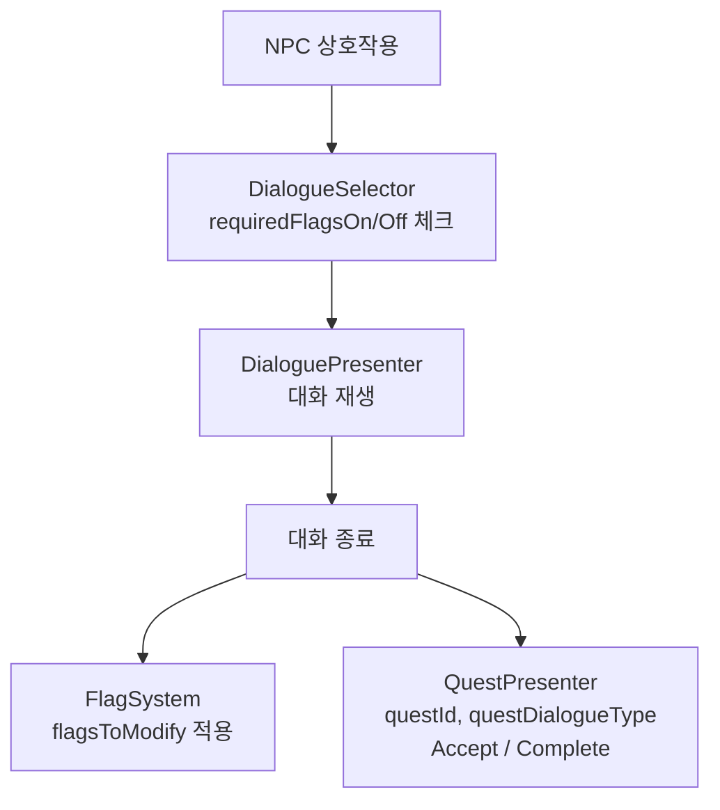

| 구분 | 내용 |
|------|------|
| **문제** | 대화 분기·퀘스트 수락/완료를 하드코딩하면 시나리오 추가가 어려움 |
| **해결** | DialogueData(ScriptableObject)에 `requiredFlagsOn/Off`(선택 조건), `flagsToModify`(종료 시 플래그), `questId`·`questDialogueType`(수락/완료)로 정의. 시나리오 설계자는 에셋만 수정 |
| **결과** | 코드 수정 없이 대화·퀘스트 흐름 추가·변경 가능 |

---

## 3. 전체 시스템 아키텍처

> PlayScene이 조율층으로, 모든 시스템을 연결·초기화·이벤트 구독한다.

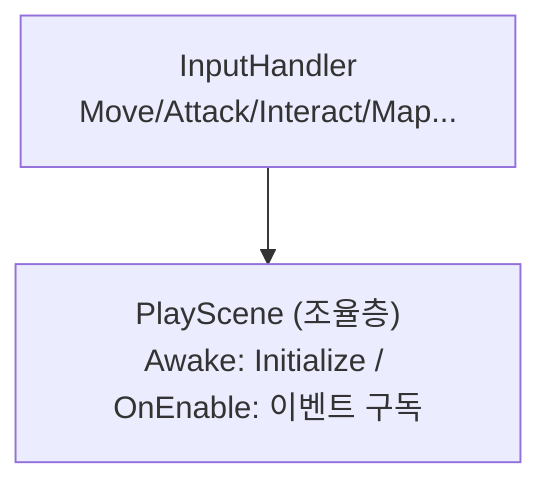

PlayScene은 SquadController, EnemySpawner, CombatController, InventoryPresenter, DialogueController, QuestController, MapController, PortalController, CursorController, SettingsView, PlaySaveCoordinator 등 다양한 시스템 간의 연결·조율을 담당한다.

### 3.1 분대·캐릭터 시스템

Character는 **컴포넌트화**되어 있다. 한 오브젝트에 Model·Mover·Animator·Interactor·Attacker·StateMachine 등 여러 컴포넌트를 조합하고, Request API로 외부(InputHandler, AIBrain)와 통일된 방식으로 연동한다.

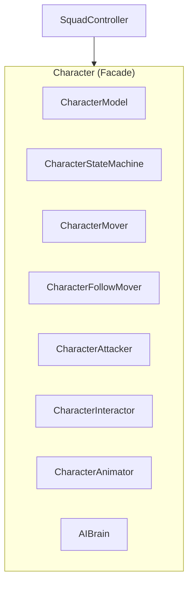

**주요 컴포넌트**
| 컴포넌트 | 역할 |
|----------|------|
| Character | Facade. Request API 제공. Model·StateMachine·Mover·Attacker·Interactor·Animator·AIBrain 등 조합 |
| CharacterModel | HP, 스탯, CharacterData 보유 |
| CharacterStateMachine | Idle·Move·Attack·Dead 상태 관리 |
| CharacterMover | 플레이어용 방향 이동 |
| CharacterFollowMover | 동료용 NavMesh 목표 이동 |
| CharacterAttacker | 공격 로직·사거리 판단 |
| CharacterInteractor | IInteractReceiver. 상호작용 수신 |
| CharacterAnimator | 애니메이션 연동 |
| AIBrain | 동료 전용. TickFollow/TickCombat |
| SquadController | 분대 스폰, 플레이어/동료 관리, SetFollowTarget |

Request API·ApplyMovement 분기·통합 상태머신 등 상세는 2.1 참조.

**핵심 코드**

```csharp
// SquadController.cs - 분대 전체 Follow 타겟 설정
public void SetFollowTarget(Transform target)
{
    foreach (var c in _characters)
    {
        if (c == null || c.transform == target) continue;
        c.SetFollowTarget(target);
    }
}
```

### 3.2 전투·적 시스템

Enemy도 Character처럼 **컴포넌트화**되어 있다.

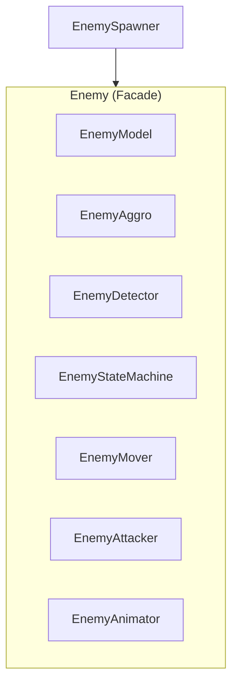

**주요 컴포넌트**
| 컴포넌트 | 역할 |
|----------|------|
| Enemy | Facade. Model·Aggro·Detector·StateMachine·Mover·Attacker·Animator 등 조합 |
| EnemyModel | HP, 스탯, EnemyData. 어그로 수치·탐지 반경 등 |
| EnemyDetector | Physics.OverlapSphere로 반경 내 Character 감지. OnCharacterDetected 발행 |
| EnemyAggro | 거리별 어그로 누적. HasAnyAboveThreshold, GetHighestAggroTarget |
| EnemyStateMachine | Idle·Patrol·Chase·Attack·Dead. 어그로 임계값 초과 시 전투 진입 |
| EnemyMover | NavMesh 기반 이동 |
| EnemyAttacker | 공격·Hitbox 연동 |
| CombatController | 전투 중인 Enemy 목록 관리. IsInCombat, GetNearestEnemy. AIBrain에 주입 |

**전투 연계** EnemyDetector가 분대(Character) 감지 → EnemyAggro에 어그로 누적 → 임계값 초과 시 EnemyStateMachine이 Chase/Attack 진입 → CombatController에 등록 → AIBrain이 IsInCombat·GetNearestEnemy로 동료 전투 판단(TickCombat). SquadController.Initialize(combatController)로 AIBrain에 CombatController 주입. 적 사망 시 HandleDeath → 3초 후 Destroy, _dropPrefab 드롭.

### 3.3 인벤토리 시스템

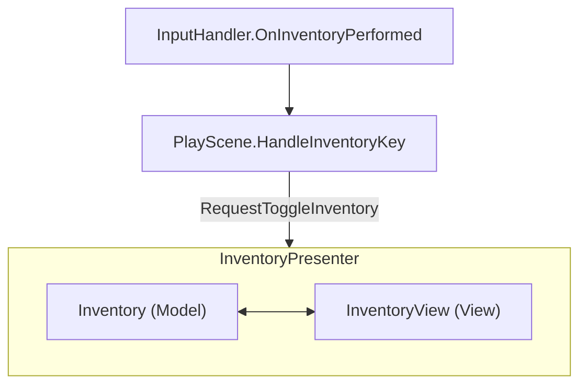

**주요 컴포넌트**
| 컴포넌트 | 역할 |
|----------|------|
| InventoryPresenter | Model·View 연결. RequestToggleInventory, SetPlayerCharacter. OnUseItemRequested→TryUseItem, OnDropEnded→SwapItems |
| Inventory | 슬롯 배열, AddItem, SetItemUser, TryUseItem, SwapItems. GameEvents.OnItemPickedUp 구독. Quest 완료 시 아이템 차감 |
| InventoryView | UI 표시. OnUseItemRequested, OnDropEnded, OnRefreshRequested. ToggleInventory |

PlayScene.HandlePlayerChanged → InventoryPresenter.SetPlayerCharacter (플레이어 변경 시 소비품 효과 대상 ItemUser 갱신)

**핵심 코드**

```csharp
// Inventory.cs - 스택 가능/불가 아이템 처리
public void AddItem(ItemData itemData, int amount = 1)
{
    if (itemData == null) return;
    if (itemData.IsStackable)
    {
        foreach (var slot in _slots)
        {
            if (slot.Item != null && slot.Item.ItemId == itemData.ItemId && slot.Count < itemData.MaxStack)
            {
                int canAdd = itemData.MaxStack - slot.Count;
                int amountToAdd = Mathf.Min(amount, canAdd);
                slot.Count += amountToAdd;
                amount -= amountToAdd;
                OnSlotChanged?.Invoke(slot);
                if (amount <= 0) { NotifyItemChangedWithId(itemData.ItemId); return; }
            }
        }
    }
    while (amount > 0)
    {
        int emptySlotIndex = FindEmptySlotIndex();
        if (emptySlotIndex == -1) break;
        int amountToPut = Mathf.Min(amount, itemData.MaxStack);
        _slots[emptySlotIndex].Item = new ItemModel(itemData);
        _slots[emptySlotIndex].Count = amountToPut;
        amount -= amountToPut;
        OnSlotChanged?.Invoke(_slots[emptySlotIndex]);
    }
    NotifyItemChangedWithId(itemData.ItemId);
}
```

### 3.4 대화 시스템

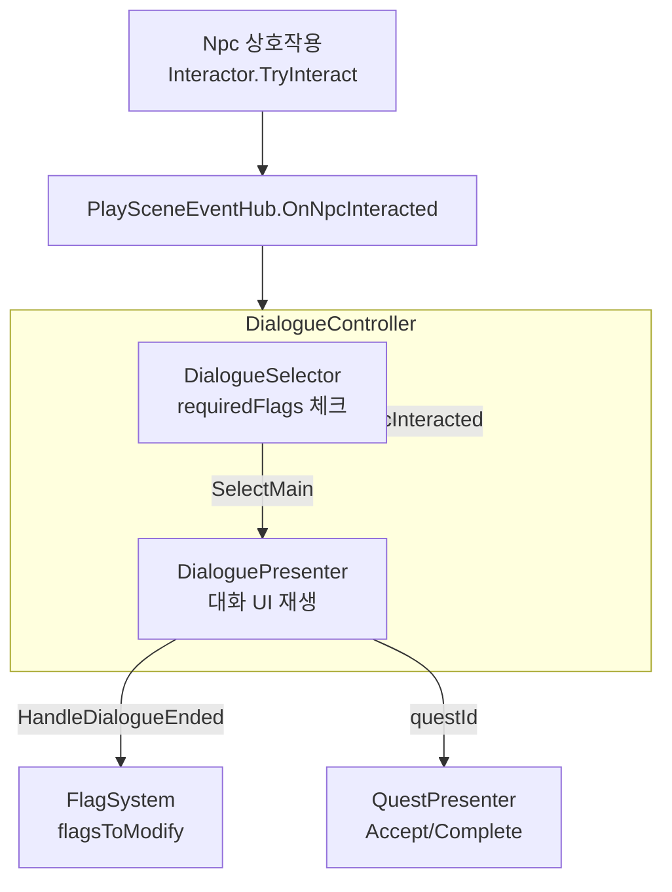

**주요 컴포넌트**
| 컴포넌트 | 역할 |
|----------|------|
| DialogueController | PlaySceneEventHub.OnNpcInteracted 구독. Selector.SelectMain → Presenter.RequestStartDialogue. HandleDialogueEnded → ApplyFlags, RequestQuestAction |
| DialogueSelector | DataManager·FlagSystem 기반. SelectMain(npcId): requiredFlagsOn/Off 체크 후 재생할 대화 1개 선택. GetAvailableQuests |
| DialoguePresenter | DialogueSystem↔DialogueView 연결. RequestStartDialogue, OnDialogueEnded 발행 |
| DialogueSystem | 대화 상태·진행. StartDialogue |
| DialogueView | 대화 UI. OnNextClicked, OnEndClicked, OnQuestDialogueSelected |
| FlagSystem | flagsToModify 적용 (Set/Add) |
| QuestPresenter | questId·questDialogueType에 따라 RequestAcceptQuest, RequestCompleteQuest |

끝내기 버튼: 타이핑 중 첫 클릭=스킵, 두 번째 클릭=대화 종료

### 3.5 퀘스트 시스템

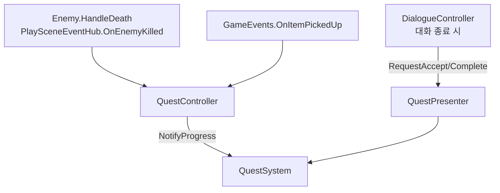

**주요 컴포넌트**
| 컴포넌트 | 역할 |
|----------|------|
| QuestController | OnEnemyKilled, OnItemPickedUp 구독 → QuestSystem.NotifyProgress. OnQuestUpdated: 목표 달성 플래그, Gather 시 인벤토리 동기화. OnQuestCompleted: 완료 플래그, Gather 아이템 차감, RecruitmentQuestData면 AddCompanion |
| QuestPresenter | QuestSystem↔QuestView 연결. RequestAcceptQuest, RequestCompleteQuest. DialogueController에 주입 |
| QuestSystem | NotifyProgress(targetId), AcceptQuest, CompleteQuest. OnQuestUpdated, OnQuestCompleted |

**동료 영입** RecruitmentQuestData: 퀘스트 완료 시 `recruitCharacterId`로 CharacterData 참조해 SquadController.AddCompanion 호출. 대화·퀘스트 완료 플래그(`quest_*_completed`)로 수락 대화 재표시 여부 제어.

**핵심 코드**

```csharp
// QuestSystem.cs - targetId 기반 진행 (다른 시스템과 무관한 API)
public void NotifyProgress(string targetId)
{
    foreach (var quest in _activeQuests)
    {
        if (quest.IsCompleted || quest.TargetId != targetId) continue;
        quest.CurrentAmount = Math.Min(quest.CurrentAmount + 1, quest.TargetAmount);
        if (quest.IsCompleted)
            Debug.Log($"<color=green>{quest.Title}</color> 목표 달성! NPC에게 돌아가세요.");
        OnQuestUpdated?.Invoke(quest);
    }
}
```

### 3.6 맵 시스템

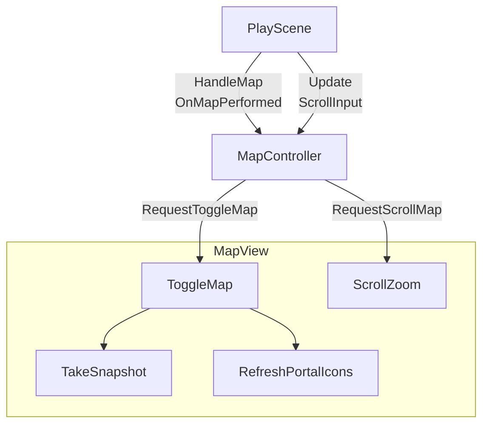

**주요 컴포넌트**
| 컴포넌트 | 역할 |
|----------|------|
| MapController | RequestToggleMap, RequestScrollMap. MapView에 위임. Initialize(PortalController, Character, SquadController) |
| MapView | ToggleMap(패널 On/Off), ScrollZoom(마우스 휠), TakeSnapshot, RefreshPortalIcons. MapCamera(RenderTexture 스냅샷), PortalController(해금 포탈), SquadController(플레이어 위치) 참조. Update에서 플레이어 아이콘 실시간 갱신 |

### 3.7 포탈 시스템

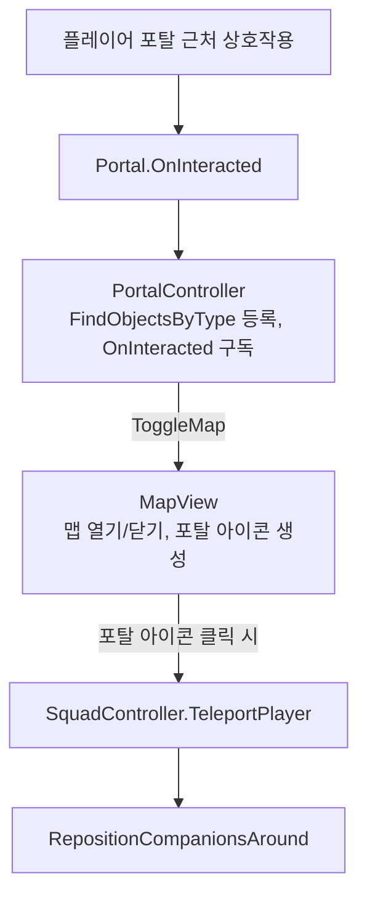

**주요 컴포넌트**
| 컴포넌트 | 역할 |
|----------|------|
| Portal | IInteractable. Interact 시 OnInteracted(IInteractReceiver, Portal) 발행. PortalData 표시용, ArrivalPosition 제공 |
| PortalDetector | OnTriggerStay/Exit로 반경 내 플레이어 감지. Portal에 연결되어 PortalEffect 토글 |
| PortalController | FindObjectsByType으로 포탈 등록, Portal.OnInteracted 구독. HandlePortalInteracted에서 MapView.ToggleMap 호출. PortalModel 목록 유지 |
| PortalModel | Portal + FlagSystem. 해금 여부 관리. MapView에서 해금된 포탈만 아이콘 표시 |
| MapView | Map_PortalIcon 생성(해금된 PortalModel만). OnPortalClicked 시 SquadController.TeleportPlayer 호출 후 맵 닫기 |
| SquadController | TeleportPlayer(ArrivalPosition), TeleportToDefaultPoint(끼임 탈출), RepositionCompanionsAround |

---

## 4. 부록: 사용 에셋

본 프로젝트에서 사용한 Asset Store 에셋 목록

| 에셋 (폴더) | 사용 용도 |
|-------------|-----------|
| FemaleAssasin | 캐릭터 모델·애니메이션 |
| PicoChan | 캐릭터 모델 |
| SapphiArtchan | 캐릭터 모델 |
| Stellar Girl Celeste | 캐릭터 모델 |
| Monster_Wolf | 적(늑대) 모델 |
| Space_Exploration_GUI_Kit | UI (인벤토리, 퀘스트 등) |
| Classic_RPG_GUI | UI 부품 |
| RunesAndPortals | 포탈·이펙트 |
| Town | 마을 맵·환경 |
| Lowpoly_Environments | 맵·환경 |
| Lowpoly_Demos | 데모 맵 |
| Lowpoly_Village | 마을 오브젝트 |
| Fruits and Vegetables | 오브젝트 |
| FREE Food Pack | 음식 오브젝트 |
| Sci-fi Sword | 무기 |
| Stylized Fantasy Weapons Pack | 무기 모델 |
| CharacterAnimation / Human Animations | 애니메이션 |
| DOTween (Plugins) | 트윈 애니메이션 |

---

## 5. 사용 Tool

### 5.1 개발
| Tool | 버전/내용 |
|------|-----------|
| **Unity** | 6000.0.59f2 (Unity 6) |
| **Git** | 버전 관리 |
| **Cursor** | AI 기반 코드 에디터 (개발·리팩터링 보조) |

개발 시 Unity 에디터 전용 디버깅 기능(Squad, Quest, Inventory, Portal 등)을 사용함.

**디버거 인스펙터 뷰**

| Squad | Quest |
|:---:|:---:|
|  |  |

| Inventory | Portal |
|:---:|:---:|
|  |  |

| EnemySpawner | Flag |
|:---:|:---:|
|  |  |

**주요 패키지**
- Unity AI Navigation 2.0.9
- Cinemachine 3.1.5
- Input System 1.14.0
- Universal RP 17.1.0

### 5.2 제작·문서
| Tool | 용도 |
|------|------|
| **Capcut** | 영상 편집 |
| **Notion** | 개발일지·문서 정리 |

---

### 참고

- **Repository**: https://github.com/ProgramingLanguageStudy/Squad_System_Framework
